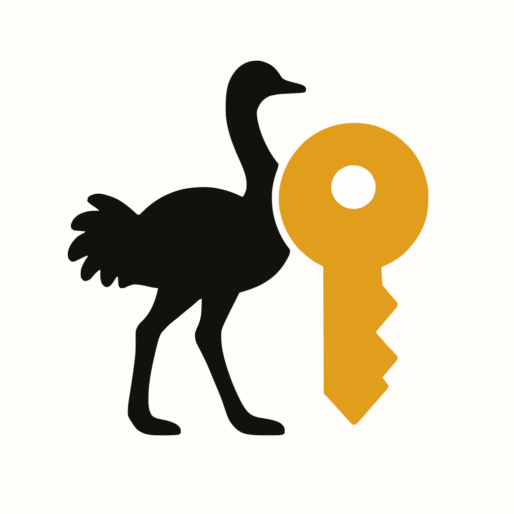

<div align="center">
  
  <h1>Nosskey SDK</h1>
  <p>パスキーでラップされたNostr鍵のためのSDK</p>
</div>

## Nosskeyの概要と目的

Nosskey（"**Nos**tr"と"pass**key**"を組み合わせた造語）は、WebAuthn（パスキー）技術を活用してNostrの秘密鍵を安全に管理し、イベントに署名します。Nostrプロトコルでは秘密鍵の安全な管理が課題となっていますが、本SDKはパスキー技術を用いることで、高いセキュリティと優れたユーザー体験の両立を実現します。

このSDKは、以前開発が進められていた[nosskey](https://github.com/ocknamo/nosskey)のコンセプトを継承していますが、WebAuthnのPRF拡張を活用することでブレイクスルーが行われ、全く異なるアプローチになりました。

## パスキー（WebAuthn）とNostrの連携の利点

従来のNostr秘密鍵管理では、平文保存やパスワード保護形式（NIP-49）が一般的でしたが、セキュリティと利便性の面で課題がありました。WebAuthnを活用することで以下の利点が得られます：

- **フィッシング耐性**: ドメイン検証により不正サイトでの認証が不可能
- **自動バックアップ**: 秘密鍵の管理をプラットフォームのパスキー同期機能に任せることで、安全なクラウドバックアップが実現
- **クロスデバイス**: OSのパスキー同期機能で複数デバイスでも同じ体験

## 主な機能と特徴

- 📲 **生体認証連携**: 指紋・顔認証などのパスキー認証と連携
- 🔐 **フィッシング耐性**: ドメイン検証によりフィッシングサイトでの不正利用を防止
- ⚡ **高速な処理**: WebAuthn PRF拡張を活用した効率的な実装
- 🔄 **クロスデバイス対応**: OSのパスキー同期機能で複数デバイスでも利用可能

## インストール方法

```bash
npm install nosskey-sdk
```

## 基本的な使用例

### パスキー作成と新規Nostr鍵生成

```javascript
import { NosskeyManager } from 'nosskey-sdk';

const keyMgr = new NosskeyManager();

// パスキーの作成（ブラウザのパスキーUI表示）
const credentialId = await keyMgr.createPasskey();

// PRF値を直接Nostrキーとして使用
const keyInfo = await keyMgr.createNostrKey(credentialId);
keyMgr.setCurrentKeyInfo(keyInfo);

// 公開鍵の取得
const publicKey = await keyMgr.getPublicKey();
console.log(`公開鍵: ${publicKey}`);

// イベントの署名
const event = {
  kind: 1,
  content: 'Hello Nosskey!',
  tags: [],
  created_at: Math.floor(Date.now() / 1000)
};
const signedEvent = await keyMgr.signEvent(event);
```

## サポート環境

Nosskey SDKはWebAuthnとPRF拡張をサポートするブラウザ環境で動作します。また、パスキーの生成と認証には対応するOS・デバイスの認証器が必要です。主な対応状況は以下の通りです：

- **ChromeおよびChromiumベースのブラウザ**: バージョン118以降でサポート
- **Safari**: macOS 14.0（Sonoma）以降、iOS 17以降でサポート
- **Firefox**: WebAuthnはサポートしていますが、PRF拡張のサポートは制限的

詳細な対応状況については[PRF対応表](docs/ja/prf-support-tables.ja.md)を参照してください。

## サンプルアプリケーション

[examples/svelte-app](examples/svelte-app/README.md)にサンプルアプリケーションの詳細があります。このアプリケーションは、Nosskey SDKの機能を活用して、PasskeyとNostrを組み合わせたデモを提供します。

実際の動作を確認するには、オンラインデモ: [https://nosskey.app](https://nosskey.app) にアクセスしてください。

## ライセンス情報

このプロジェクトはMITライセンスの下で公開されています。詳細は[LICENSE](LICENSE)ファイルを参照してください。

## 詳細ドキュメント

さらに詳しい実装や仕様については以下のドキュメントを参照してください：

- [Nosskey仕様](docs/ja/nosskey-specification.ja.md) - 基本概念と実装アプローチ
- [SDKインターフェース](docs/ja/nosskey-sdk-interface.ja.md) - API詳細と使用例
