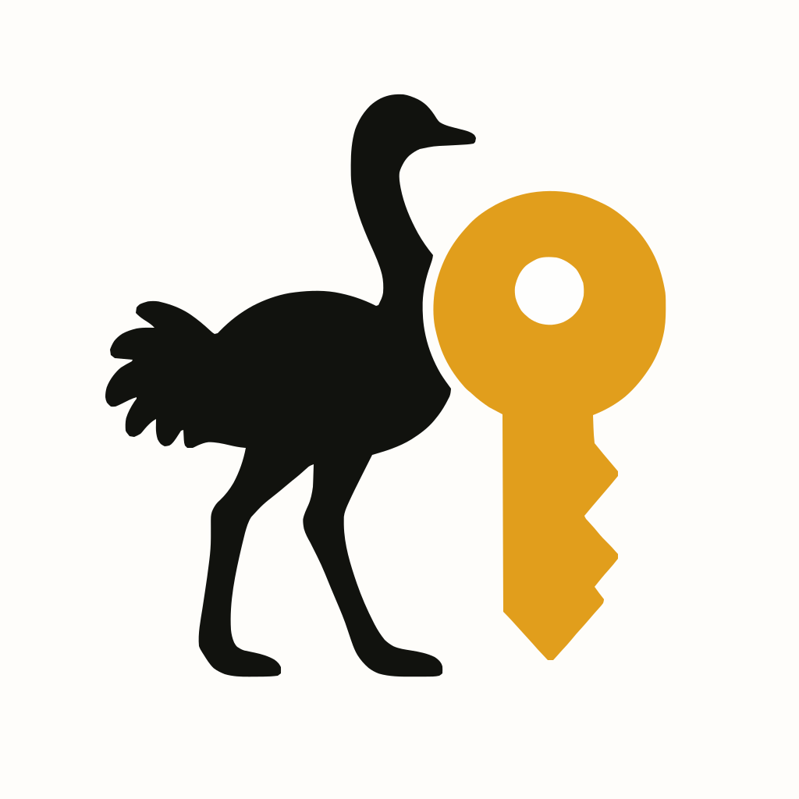

<div align="center">
  
  <h1>Nosskey SDK</h1>
  <p>SDK for Nostr keys wrapped with passkeys</p>
</div>

## Overview and Purpose of Nosskey

Nosskey (a portmanteau of "**Nos**tr" and "pass**key**") is a securely managing Nostr private keys and signing events using WebAuthn (passkey) technology. While secure management of private keys has been a challenge in the Nostr protocol, this SDK achieves both high security and excellent user experience by utilizing passkey technology.

This SDK inherits the concept from the previously developed [nosskey](https://github.com/ocknamo/nosskey), but represents a completely different approach thanks to a breakthrough made possible by utilizing the WebAuthn PRF extension.

This approach is planned to be proposed as a Nostr Implementation Possibility (NIP).

## Benefits of Integrating Passkeys (WebAuthn) with Nostr

Traditional Nostr private key management methods, such as plaintext storage or password-protected format (NIP-49), have presented challenges in terms of security and convenience. Using WebAuthn offers the following benefits:

- **Phishing Resistance**: Domain validation prevents authentication on fraudulent sites
- **Automatic Backup**: Entrusting private key management to the platform's passkey synchronization function enables secure cloud backup
- **Cross-Device Support**: OS passkey synchronization features provide the same experience across multiple devices

## Key Features

- 📲 **Biometric Authentication**: Integration with passkey authentication such as fingerprint and face recognition
- 🔐 **Phishing Resistance**: Domain validation prevents unauthorized use on phishing sites
- ⚡ **Fast Processing**: Efficient implementation utilizing WebAuthn PRF extension
- 🔄 **Cross-Device Support**: Available on multiple devices through OS passkey synchronization
- 🔧 **Flexible Approach**: Supports both direct PRF value utilization and encryption/decryption methods

## Installation

```bash
npm install nosskey-sdk
```

## Basic Usage Examples

### Creating a Passkey and Generating a New Nostr Key (Recommended Approach)

```javascript
import { NosskeyManager } from 'nosskey-sdk';

const keyMgr = new NosskeyManager();

// Create a passkey (displays browser's passkey UI)
const credentialId = await keyMgr.createPasskey();

// Use PRF value directly as a Nostr key
const key = await keyMgr.directPrfToNostrKey(credentialId);
keyMgr.setCurrentKeyInfo(key);

// Get the public key
const publicKey = await keyMgr.getPublicKey();
console.log(`Public key: ${publicKey}`);

// Sign an event
const event = {
  kind: 1,
  content: 'Hello Nosskey!',
  tags: [],
  created_at: Math.floor(Date.now() / 1000)
};
const signedEvent = await keyMgr.signEvent(event);
```

### Importing an Existing Key (Alternative Approach)

```javascript
import { NosskeyManager } from 'nosskey-sdk';
import { hexToBytes } from 'nosskey-sdk';

const keyMgr = new NosskeyManager();

// Create a passkey
const credentialId = await keyMgr.createPasskey();

// Import an existing Nsec private key
const existingSecretKey = hexToBytes('7f...'); // 32-byte private key
const key = await keyMgr.importNostrKey(existingSecretKey, credentialId);
keyMgr.setCurrentKeyInfo(key);
```

## Supported Environments

Nosskey SDK works in browser environments that support WebAuthn and the PRF extension. Passkey generation and authentication also require authenticators from compatible OS/devices. The main compatibility status is as follows:

- **Chrome and Chromium-based browsers**: Supported in version 118 and later
- **Safari**: Supported in macOS 14.0 (Sonoma) and later, iOS 17 and later
- **Firefox**: Supports WebAuthn, but PRF extension support is limited

For detailed compatibility information, please refer to the [PRF Support Tables](docs/en/prf-support-tables.en.md).

## Sample Application

Details of the sample application can be found in [examples/svelte-app](examples/svelte-app/README.md). This application provides a demo combining Passkey and Nostr using the features of the Nosskey SDK.

To see it in action, visit the online demo: [https://nosskey.app](https://nosskey.app).

## License Information

This project is released under the MIT License. For details, please refer to the [LICENSE](LICENSE) file.

## Detailed Documentation

For more detailed implementation and specifications, please refer to the following documents:

- [Nosskey Specification](docs/en/nosskey-specification.en.md) - Basic concepts and implementation approaches
- [SDK Interface](docs/en/nosskey-sdk-interface.en.md) - API details and usage examples
