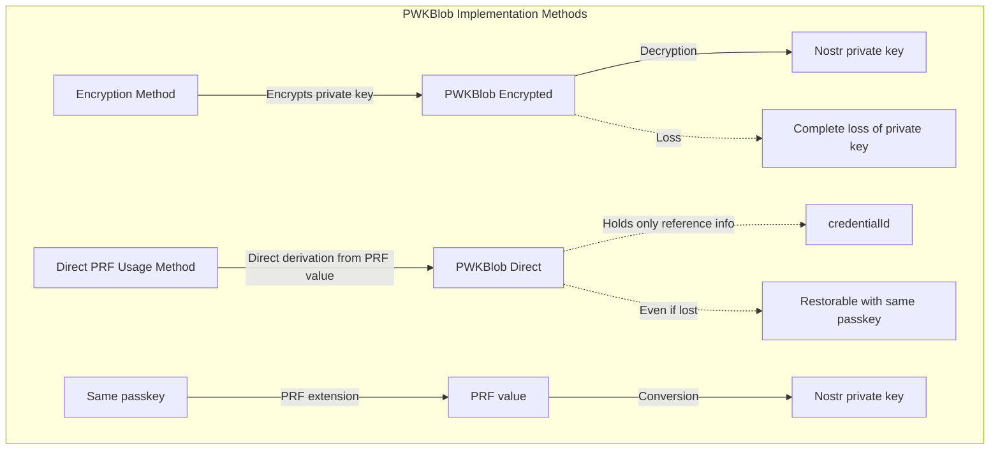
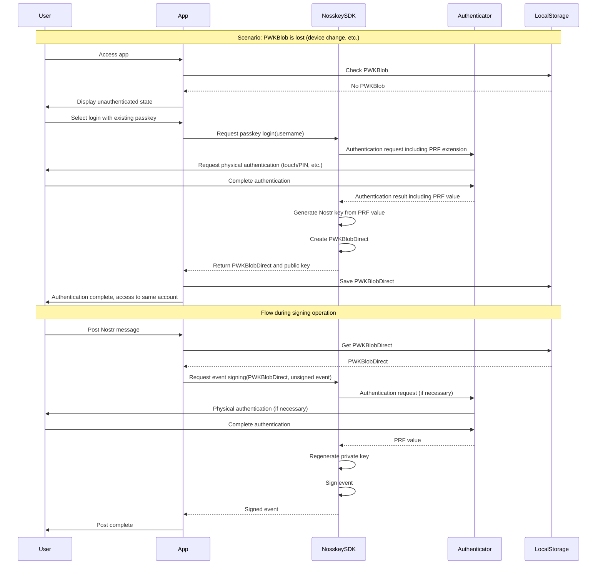

# User Authentication Use Cases in Nosskey and the PWKBlob Concept

## 1. PWKBlob Concept and Implementation Methods

PWKBlob (Passkey Wrapped Key Blob) is Nosskey's core technical concept, a data structure that bridges passkey authentication and Nostr private key management. Currently, there are two implementation methods:

1. **Encryption Method (PWKBlobEncrypted)**: 
   - Stores Nostr private key encrypted with a key derived from a passkey
   - **Loss of PWKBlob means complete loss of the private key, with no possibility of recovery**
   - **Requires consideration of private key backup and storage methods on relays as countermeasures**

2. **Direct PRF Usage Method (PWKBlobDirect)**: 
   - Derives Nostr private key directly from the passkey's PRF extension
   - PWKBlobDirect contains only the usage method and credentialId
   - The same passkey and the same salt always generate the identical private key
   - Even if PWKBlob is lost, the private key can be restored simply by re-authenticating with the same passkey



## 2. Private Key Restoration Mechanism (Direct PRF Usage Method)



## 3. Benefits of PWKBlobDirect

The main advantages of PWKBlobDirect are as follows:

1. **Ease of Restoration**: 
   - Private key is not explicitly stored but is generated each time during passkey authentication
   - Since the same PRF value is always obtained from the same passkey and same salt, the same key can be restored after device changes or localStorage clearing

2. **UX Improvement**: 
   - With PWKBlobDirect, there's no need to select authentication methods or passkey types, simplifying user operations
   - Eliminates the burden of private key backup management (only passkey management is needed)

3. **Security**: 
   - Reduced risk of leakage since the private key is not persistently stored
   - Key generation and usage occur as part of passkey authentication, integrating authentication and signing

## 4. User Authentication Use Cases

### 4.1 Use Case Diagram

```mermaid
graph TD
  subgraph "User Authentication Use Cases"
    User((User))
    
    UC1[First Registration (New Passkey Creation)]
    UC2[Login with Existing Passkey]
    UC3[Normal Logout]
    UC4[Logout by Clearing Browser Data]
    UC5[Account Recovery when Changing Devices]
    UC6[Automatic Authentication when Revisiting App]
    UC7[PRF Extension Support Check]
    UC8[Change Cache Settings]
    
    User --> UC1
    User --> UC2
    User --> UC3
    User --> UC4
    User --> UC5
    User --> UC6
    User --> UC7
    User --> UC8
  end
```

### 4.2 Use Case Details

#### 4.2.1 First Registration (New Passkey Creation)
- **Actor**: User
- **Description**: New user creates a new passkey and sets up a Nostr account
- **Basic Flow**:
  1. User clicks the PRF extension support check button
  2. App checks PRF extension support via NosskeySDK (this step can be skipped as passkey creation is needed for confirmation)
  3. If PRF extension support is confirmed, click "Create New Passkey" button
  4. Enter username
  5. NosskeySDK handles communication with the authenticator
  6. Authenticate on the authenticator
  7. Passkey is created
  8. Since PRF value is not generated during passkey creation, click "First Login" button again
  9. NosskeySDK generates Nostr key from PRF value and creates PWKBlobDirect
  10. App saves PWKBlobDirect to localStorage
  11. Automatic transition to account screen

#### 4.2.2 Login with Existing Passkey
- **Actor**: User
- **Description**: Login using a previously created passkey
- **Basic Flow**:
  1. Click "Login with Existing Passkey" button
  2. Select your registered passkey in the platform UI
  3. NosskeySDK executes authentication processing and communicates with authenticator
  4. Authenticate on the authenticator
  5. NosskeySDK generates Nostr key from PRF value and creates PWKBlobDirect
  6. SDK returns PWKBlobDirect to the app
  7. App or SDK itself saves PWK to localStorage
  8. Automatic transition to account screen

#### 4.2.3 Normal Logout
- **Actor**: User
- **Description**: Explicitly log out using the app's functions
- **Precondition**: Authenticated state
- **Basic Flow**:
  1. Click logout button
  2. Reset state (clear PWKBlob, etc.)
  3. Transition to account screen (unauthenticated state)

#### 4.2.4 Logout by Clearing Browser Data
- **Actor**: User
- **Description**: Implicit logout by clearing browser's localStorage
- **Precondition**: Authenticated state
- **Basic Flow**:
  1. Clear localStorage from browser settings
  2. When revisiting app, user will be in unauthenticated state

#### 4.2.5 Account Recovery when Changing Devices
- **Actor**: User
- **Description**: Restore the same Nostr account on a new device
- **Precondition**: Possess the same passkey (cloud-backed platform authenticator or physical authenticator)
- **Basic Flow**:
  1. Access app on new device (no PWKBlob)
  2. Select "Login with Existing Passkey"
  3. **Enter the same username as before** (important)
  4. Authenticate with the same authenticator
  5. The same PRF value is generated, and the same Nostr key pair is derived
  6. Account is restored with the original Nostr public key (profile, etc. are retrieved from relays)

#### 4.2.6 Automatic Authentication when Revisiting App
- **Actor**: User
- **Description**: When a previously authenticated user accesses the app again after closing the browser
- **Precondition**: Previously authenticated with PWKBlob saved in localStorage
- **Basic Flow**:
  1. Check localStorage when app starts
  2. If PWKBlob exists, automatically set to authenticated state
  3. Account screen is displayed

#### 4.2.7 Nostr Event Signing Process
- **Actor**: User
- **Description**: Signing Nostr events (posts, etc.) within the app
- **Basic Flow**:
  1. User enters and submits content
  2. SDK retrieves PWKBlobDirect from localStorage
  3. App passes unsigned event to NosskeySDK for signing request
  4. NosskeySDK handles communication with authenticator (re-authentication if necessary)
  5. Regenerates private key from PRF value and signs event internally in SDK
  6. Signed event is returned to app and sent to relay

## 5. Relationship Between PWKBlob and Nostr Private Key (PWKBlobEncrypted vs PWKBlobDirect)

| Characteristic | PWK Encryption Method | Direct PRF Usage Method |
|----------------|----------------------|-------------------------|
| Private Key Storage Method | Stored encrypted | Not stored, generated each time |
| PWKBlob Contents | Encrypted private key | Only method information and credentialId |
| When PWKBlob is Lost | **Complete loss of private key (irrecoverable)** | Fully restorable with the same passkey |
| Risk Countermeasures | **Need to consider backup and relay storage** | Only passkey management needed |
| Security Characteristics | Private key exists but is encrypted | Private key is generated only temporarily |
| UX Characteristics | Completed with authentication only | Completed with authentication only |
| SDK Role | Executes private key encryption/decryption with PRF value, signature processing internally | Key generation from PRF value, signature processing completed internally |

## 6. Division of Responsibilities Between Application and SDK

NosskeySDK handles the following responsibilities, abstracting complex processing from the application:

1. **Communication with Authenticator**: 
   - Wraps complex WebAuthn API calls
   - Handles PRF extension requests
   - Processes all communication with authenticator

2. **PWKBlob Processing**:
   - Creation, verification, and basic storage (localStorage) of PWKBlob
   - Management of PWKBlob format
   - **※Complex account management such as multiple storage/retrieval of PWKBlob is the app's responsibility**

3. **Nostr Key Processing**:
   - Conversion from PRF value to Nostr key
   - Secure management of private key (temporary holding in memory)
   - Internal processing of event signing

4. **State Management Assistance**:
   - Key cache management (optional)

The application side is responsible for:

1. **UI/UX**: 
   - Providing user interface
   - Screen display according to authentication state

2. **Data Persistence**:
   - **Complex account management such as multiple storage/retrieval of PWKBlob**
   - Management of other application data
   - Backup processing of PWKBlobEncrypted to relays

3. **Authentication State Management**:
   - Determination of authentication state based on presence of PWKBlob

4. **Business Logic**:
   - Creation of Nostr events
   - Communication with relays

## 7. Unique Points of Restoration

The most distinctive feature of Nosskey is that **"even without backing up the private key, the exact same Nostr account can be fully restored as long as you have the same passkey and the same salt"**. This architecture leverages the characteristics of the PRF extension, solving the traditional challenges of private key management (backup, leakage risk).

For users, it provides an intuitive mental model of "as long as you have your passkey (physical authenticator), you can access your Nostr account from any device", significantly improving UX.
