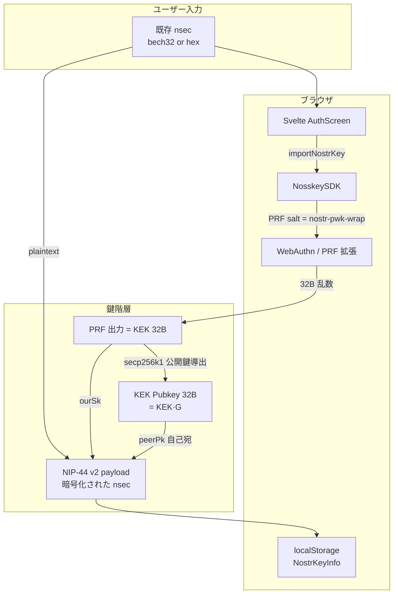
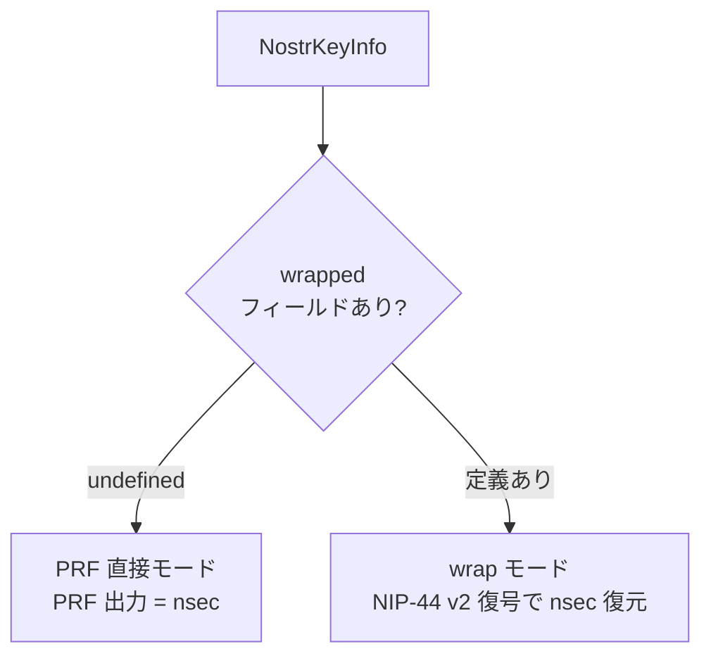
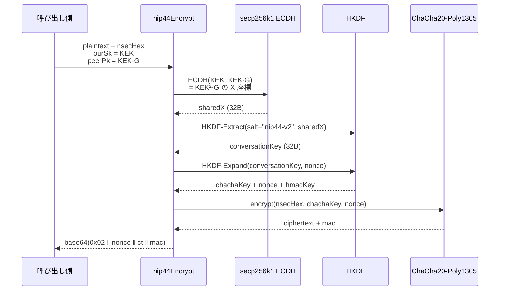
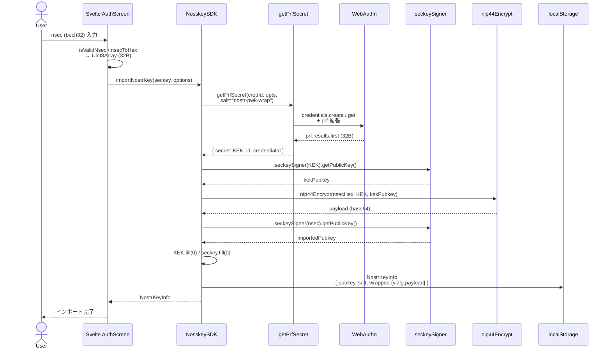
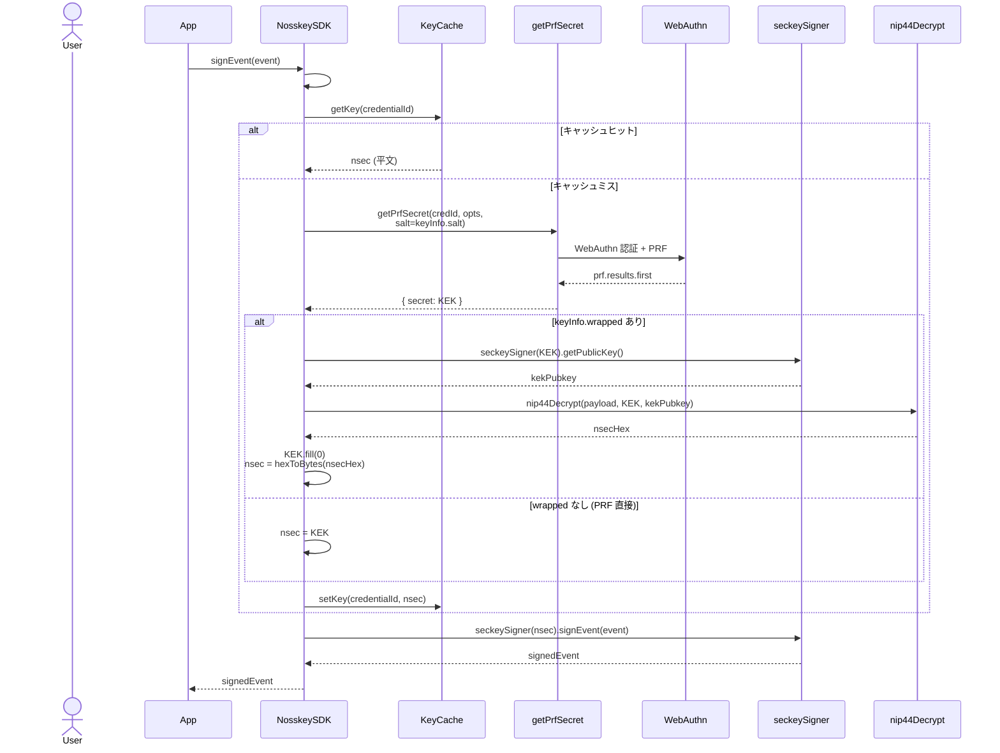
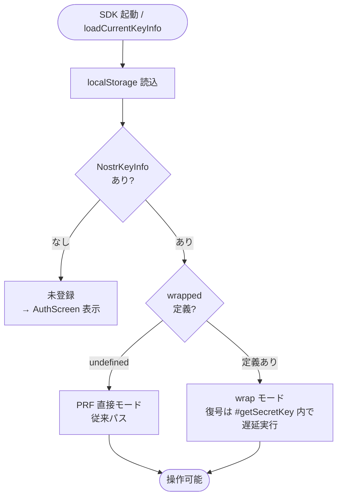
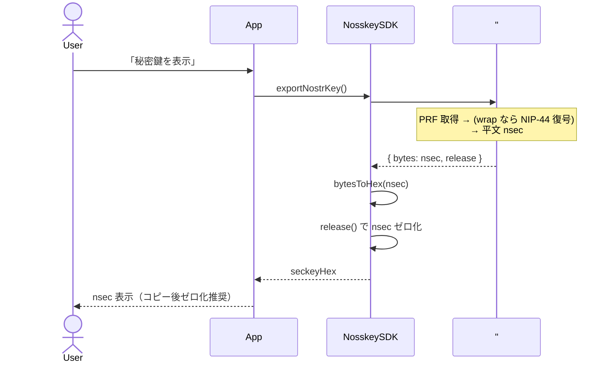
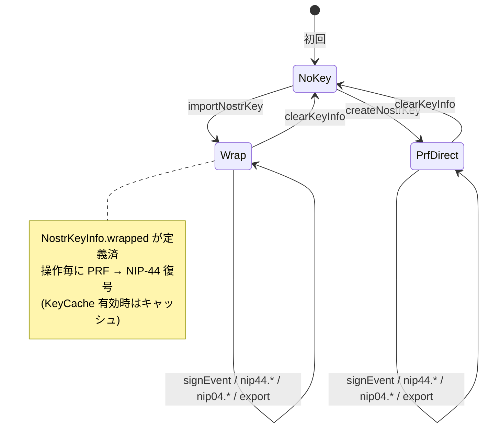

# 設計書: 既存 nsec のパスキー PRF ラップ保存（wrap モード）

## 目次

- [1. 目的・背景](#1-目的背景)
- [2. 用語](#2-用語)
- [3. 要件](#3-要件)
- [4. 全体アーキテクチャ](#4-全体アーキテクチャ)
- [5. データモデル](#5-データモデル)
- [6. 暗号設計](#6-暗号設計)
- [7. API 設計](#7-api-設計)
- [8. 主要ユースケースのフロー](#8-主要ユースケースのフロー)
- [9. 影響範囲（実装フェーズで触るファイル）](#9-影響範囲実装フェーズで触るファイル)
- [10. 再利用する既存資産](#10-再利用する既存資産)
- [11. セキュリティ考慮事項](#11-セキュリティ考慮事項)
- [12. 検証観点](#12-検証観点)
- [13. 代替案の比較と採用理由](#13-代替案の比較と採用理由)
- [14. 未決事項 / 今後のフォロー](#14-未決事項--今後のフォロー)

---

## 1. 目的・背景

Nosskey SDK は現在、WebAuthn パスキーの PRF 拡張出力をそのまま 32B の Nostr 秘密鍵として扱う **PRF 直接モード**のみを提供している（`packages/nosskey-sdk/src/nosskey.ts` の `createNostrKey` / `#getSecretKey`）。この方式は新規ユーザーには最適だが、**既に Nostr アカウント (nsec) を持っているユーザーには移行手段がない**。

本設計は、ユーザーが手元の nsec を SDK に渡し、それを **WebAuthn PRF 由来の鍵で暗号化して localStorage に保存**する **wrap モード** を追加するためのものである。保存後は PRF 直接モードと**区別なく**既存 API（`signEvent` / `nip44Encrypt` / `nip44Decrypt` / `nip04Encrypt` / `nip04Decrypt` / `getPublicKey` / `exportNostrKey`）で操作できる。

関連既存ドキュメント `docs/ja/nosskey-specification.ja.md` の「代替アプローチ：秘密鍵の暗号化/復号」を**具体実装レベルまで詳細化**する位置付けである。

---

## 2. 用語

| 用語 | 意味 |
|---|---|
| **PRF 直接モード** | PRF 出力 (32B) をそのまま Nostr 秘密鍵として使う既存方式 |
| **wrap モード** | ユーザーの既存 nsec を PRF 由来 KEK で暗号化して保存する新方式 |
| **KEK** (Key Encryption Key) | PRF 出力 32B。nsec を暗号化する鍵として使う |
| **インポート鍵** | ユーザーが SDK に持ち込む既存 nsec（最終的に signEvent などで使う鍵） |
| **wrap salt** | wrap モード専用の PRF salt 文字列 `"nostr-pwk-wrap"` |

---

## 3. 要件

### 3.1 機能要件

- **F1**: ユーザーは既存の nsec を SDK に渡し、パスキー登録と同時に暗号化保存できる
- **F2**: 保存後、PRF 直接モードと**区別なく** `signEvent` / `nip44Encrypt` / `nip44Decrypt` / `nip04Encrypt` / `nip04Decrypt` / `getPublicKey` / `exportNostrKey` を使える
- **F3**: PRF 直接モードと同一 SDK インスタンス・同一 iframe プロトコルで透過動作する
- **F4**: 既存の PRF 直接モードユーザーは回帰なしで動作継続（後方互換）
- **F5**: wrap 鍵を `exportNostrKey` で取り出せる（バックアップ / 移行手段）

### 3.2 非機能要件

- **NF1**: 暗号化方式は NIP-44 v2。既存実装 (`packages/nosskey-sdk/src/nip44.ts`) を**無改造**で流用
- **NF2**: KEK は WebAuthn PRF 由来。salt はドメイン分離のため `"nostr-pwk-wrap"` を使用
- **NF3**: ローカル保存先は `localStorage`（既存 PRF 直接モードと同じ）
- **NF4**: ペイロード保存形式は NIP-44 v2 base64（`0x02 || nonce(32) || ciphertext || mac(32)`）
- **NF5**: メモリゼロ化: KEK / インポート nsec は使用直後に `Uint8Array.fill(0)`
- **NF6**: 暗号化方式のバージョニング: `wrapped.v` / `wrapped.alg` を保持し、将来の方式変更に備える

### 3.3 スコープ外

- リレーへのバックアップ・同期（`docs/todo.md` の別タスク）
- nsec bech32 ↔ hex のパース処理は呼び出し側責務（既存 `examples/svelte-app/src/utils/bech32-converter.ts` を利用）
- NIP-49（パスワード暗号化形式）からのインポート

---

## 4. 全体アーキテクチャ



PRF 直接モードと wrap モードの違いを整理すると次の通り。

| 項目 | PRF 直接モード | wrap モード |
|---|---|---|
| nsec の出所 | PRF 出力そのもの | ユーザー持参の既存 nsec |
| PRF salt | `"nostr-pwk"` | `"nostr-pwk-wrap"` |
| `NostrKeyInfo.pubkey` | PRF 出力の pubkey | インポート鍵の pubkey |
| `NostrKeyInfo.wrapped` | undefined | `{v,alg,payload}` |
| 復号処理 | 不要 | NIP-44 v2 復号 |
| 暗号化保存 | なし | あり |

---

## 5. データモデル

`NostrKeyInfo` を**後方互換**で拡張する。`wrapped` フィールドの有無で 2 モードを判別する。

```ts
export interface NostrKeyInfo {
  credentialId: string;
  pubkey: string;        // インポート鍵の pubkey（KEK ではない）
  salt: string;          // wrap時 = "nostr-pwk-wrap" hex / PRF直接時 = 既存 "nostr-pwk" hex
  username?: string;
  wrapped?: {            // 未設定 = PRF 直接モード（後方互換維持）
    v: 1;                // データ形式バージョン
    alg: 'nip44-v2';     // 暗号方式識別子
    payload: string;     // nip44Encrypt の戻り値（base64）
  };
}
```

判別フロー:



---

## 6. 暗号設計

### 6.1 採用方式: NIP-44 v2 自己宛 DM パターン

既存の `nip44Encrypt(plaintext, ourSk, peerPk)` をそのまま流用し、`ourSk = KEK`, `peerPk = KEK·G` として呼び出す。これにより**新規 crypto コードを書かずに**安全な AEAD ラッピングが得られる。



### 6.2 自己 ECDH の安全性

- `ECDH(KEK, KEK·G) = KEK²·G` の X 座標が共有秘密になる
- secp256k1 は**素数位数群**なので部分群攻撃は存在しない
- `KEK` が一様 32B（PRF 出力は擬似乱数）なら `KEK²·G` も曲線上で一様分布 → 共有秘密 X も一様乱数
- NIP-44 仕様は自己宛 DM を禁じておらず、暗号学的に安全

### 6.3 PRF salt によるドメイン分離

| モード | PRF salt | salt の hex |
|---|---|---|
| PRF 直接モード（既存） | `"nostr-pwk"` | `6e6f7374722d70776b` |
| wrap モード（新規） | `"nostr-pwk-wrap"` | `6e6f7374722d70776b2d77726170` |

同じパスキーで両モードを使っても KEK と PRF 直接 nsec が一致しない。これにより wrap ペイロードを直接モード鍵で攻撃する／その逆のクロスモード漏洩を排除する。

### 6.4 plaintext / ペイロードのサイズ

- plaintext: `nsecHex` (64 chars, 64 bytes UTF-8) → NIP-44 v2 パディングで 64B（ちょうどバケット境界）
- ペイロード合計: `1(ver) + 32(nonce) + 2(len) + 64(padded plaintext) + 32(mac) = 131 bytes` → base64 約 176 chars
- localStorage 1 エントリとして問題のないサイズ

---

## 7. API 設計

### 7.1 追加 API

```ts
interface NosskeyManagerLike {
  // 既存
  createNostrKey(
    credentialId?: Uint8Array,
    options?: KeyOptions
  ): Promise<NostrKeyInfo>;

  // ★ 追加
  importNostrKey(
    seckey: Uint8Array,            // 32B nsec の生バイト
    credentialId?: Uint8Array,     // 省略時はユーザーが選んだパスキー
    options?: KeyOptions
  ): Promise<NostrKeyInfo>;

  // 既存 API は**シグネチャ不変**
  signEvent(event): Promise<SignedEvent>;
  nip44Encrypt(peerPubkey, plaintext): Promise<string>;
  nip44Decrypt(peerPubkey, payload): Promise<string>;
  nip04Encrypt(peerPubkey, plaintext): Promise<string>;
  nip04Decrypt(peerPubkey, payload): Promise<string>;
  getPublicKey(): Promise<string>;
  exportNostrKey(): Promise<string>;
}
```

### 7.2 内部振る舞いの違い

`signEvent` などの**公開シグネチャは変更しない**。SDK 内部の `#getSecretKey` が `keyInfo.wrapped` の有無で経路を分岐し、wrap モードでは PRF 後に `nip44Decrypt` を挟む。

### 7.3 入力検証

`importNostrKey` の `seckey` 引数:

- 長さ 32 バイト固定（それ以外は即例外）
- 全 0 拒否（secp256k1 invalid secret）
- 範囲チェックは `seckeySigner` の内部バリデーションに委ねる

bech32 (`nsec1...`) のパースは SDK のスコープ外。呼び出し側で `nsecToHex` → `hexToBytes` を経由する。

---

## 8. 主要ユースケースのフロー

### 8.1 既存 nsec のインポート（初回登録）



### 8.2 wrap 鍵での署名（`signEvent` 経由）



`nip44Encrypt` / `nip44Decrypt` / `nip04Encrypt` / `nip04Decrypt` / `exportNostrKey` も同じ `#getSecretKey` を経由するため、wrap モードを透過的にサポートする。

### 8.3 起動時の鍵モード判定



### 8.4 wrap 鍵のエクスポート



### 8.5 状態遷移（鍵ライフサイクル）



---

## 9. 影響範囲（実装フェーズで触るファイル）

実装フェーズで変更が見込まれるファイル一覧。**本タスク（設計書作成）では編集しない**。

| ファイル | 想定変更 |
|---|---|
| `packages/nosskey-sdk/src/types.ts` | `NostrKeyInfo.wrapped` 追加 / `NosskeyManagerLike.importNostrKey` 追加 |
| `packages/nosskey-sdk/src/nosskey.ts` | `importNostrKey` 実装 / `#getSecretKey` の wrap 分岐 / `normalizeSalt` 拡張 / `exportNostrKey` 経路統一 / `WRAP_SALT` 定数 |
| `packages/nosskey-sdk/src/nosskey.spec.ts` | ラウンドトリップ・改竄検知・回帰テスト |
| `examples/svelte-app/src/components/screens/AuthScreen.svelte` | nsec インポート UI |
| `docs/{ja,en}/nosskey-sdk-interface.md` | `importNostrKey` API ドキュメント |

---

## 10. 再利用する既存資産

| 既存資産 | 役割 | 場所 |
|---|---|---|
| `nip44Encrypt` / `nip44Decrypt` | NIP-44 v2 AEAD（**無改造**で流用） | `packages/nosskey-sdk/src/nip44.ts` |
| `getPrfSecret` | PRF 取得（salt 引数活用） | `packages/nosskey-sdk/src/prf-handler.ts` |
| `seckeySigner` | secp256k1 公開鍵導出・署名 | `@rx-nostr/crypto`（既存依存、`createNostrKey` で実績） |
| `hexToBytes` / `bytesToHex` | hex 変換 | `packages/nosskey-sdk/src/utils.ts` |
| `KeyCache` | 平文 nsec キャッシュ | `packages/nosskey-sdk/src/key-cache.ts` |
| `nsecToHex` / `isValidNsec` | bech32 ↔ hex（呼び出し側） | `examples/svelte-app/src/utils/bech32-converter.ts` |

---

## 11. セキュリティ考慮事項

1. **入力 nsec のメモリ取り回し**: `importNostrKey` 完了直後に SDK 内で `seckey: Uint8Array` をゼロ化。JSDoc に「呼び出し側でも前後にゼロ化推奨」を明記
2. **KEK ゼロ化**: NIP-44 復号直後の `finally` で `prf.fill(0)`
3. **wrap salt によるドメイン分離**: PRF 直接モードと wrap モードの KEK 値が交差しない
4. **自己 ECDH の理論的安全性**: secp256k1 素数位数群上で安全（§ 6.2 参照）
5. **AEAD の真正性**: NIP-44 v2 HMAC-SHA256 で改竄検知。`payload` の 1 bit 改竄で `invalid MAC` 例外
6. **脅威モデル**: 既存 PRF 直接モードと同じ
   - 同 rpId オリジン + パスキー保持者のみ復号可能
   - パスキー漏洩 = nsec 漏洩と等価
   - リプレイ攻撃面は WebAuthn の challenge ベースで既存と同等
7. **保存先の制約**: localStorage の特性（XSS で同オリジン JS から読める / 他オリジンからは不可）を継承
8. **データ形式バージョニング**: `wrapped.v` / `wrapped.alg` を保持し、将来の暗号方式変更時の移行余地を確保

---

## 12. 検証観点

### 12.1 単体テスト

- `importNostrKey(seckey)` 後 `getCurrentKeyInfo().wrapped !== undefined`
- `signEvent` 戻り値の `pubkey` がインポート鍵の pubkey と一致
- `nip44Encrypt` / `nip44Decrypt` ラウンドトリップ（wrap 鍵経由）
- `nip04Encrypt` / `nip04Decrypt` ラウンドトリップ（wrap 鍵経由）
- `exportNostrKey()` で元の seckey hex を完全復元
- `wrapped.payload` の 1 bit 改竄 → 復号で例外
- `wrapped.alg` が `'nip44-v2'` 以外 → 明示的な「unsupported alg」例外
- 既存 `createNostrKey` フロー（`wrapped === undefined`）の回帰確認
- 入力 32B 以外 / 全 0 → `importNostrKey` で例外

### 12.2 統合・手動テスト

- Svelte デモアプリで nsec インポート → kind=1 イベント署名 → 別ツール（nostr-tools 等）で signature 検証
- ページリロード後も pubkey が復元され、各操作が成功
- iframe-host 経由でも透過動作（プロトコル変更なし）
- DevTools で `localStorage.nosskey_keyinfo` を確認、`wrapped.payload` が base64 文字列として保存されていること
- PRF 直接モードで作成済のユーザーが引き続き動作（既存ユーザー回帰）

### 12.3 pre-commit 検証

`CLAUDE.md` 規約に従う:

```sh
npm run format:check
npm run build
npm run test:coverage
npm run check -w svelte-app
```

---

## 13. 代替案の比較と採用理由

| 案 | 概要 | 利点 | 欠点 |
|---|---|---|---|
| **A. NIP-44 v2 自己宛 DM**（採用） | `nip44Encrypt(nsecHex, KEK, KEK·G)` をそのまま呼ぶ | 新規 crypto コードゼロ / 監査負荷最小 / NIP-44 公式ベクターで検証済 | ペイロードがやや大きい（base64 約 176 chars）/ 自己 ECDH の概念的な「奇異さ」 |
| B. NIP-44 v2 内部関数直接利用 | `__nip44Internal` に padBytes/hmacWithAad 等を露出し、KEK を直接 ChaCha20 鍵に使う独自 wrap 形式 | ペイロード若干小さい | 新規 wrap モジュール / SDK 内部 API の表面積増 / テスト負荷増 |
| C. AES-GCM 等の独自 AEAD | WebCrypto の AES-GCM で wrap | 標準的 | 既存 NIP-44 と別系統 → 監査負荷増 / 鍵管理経路が二系統化 |

採用根拠: **「無改造で既存テスト済み経路を再利用できる」点が最重要**。自己 ECDH の数学的安全性は § 6.2 で示した通り問題なく、ペイロードサイズ差は localStorage 上で誤差。

---

## 14. 未決事項 / 今後のフォロー

- 英語版 `docs/en/design-existing-nsec-import.en.md` を本タスクで併せて作成するか（→ 実装フェーズ着手前に整備推奨）
- 実装フェーズで `nosskey-sdk-interface.{ja,en}.md` への `importNostrKey` API 追記をどのタイミングで行うか
- `nosskey-specification.ja.md` の「代替アプローチ」節から本設計書への相互リンクを追加するか
- `wrapped.alg = 'nip44-v2'` 以外の将来対応（例: PRF v2 / post-quantum AEAD）の判断基準
