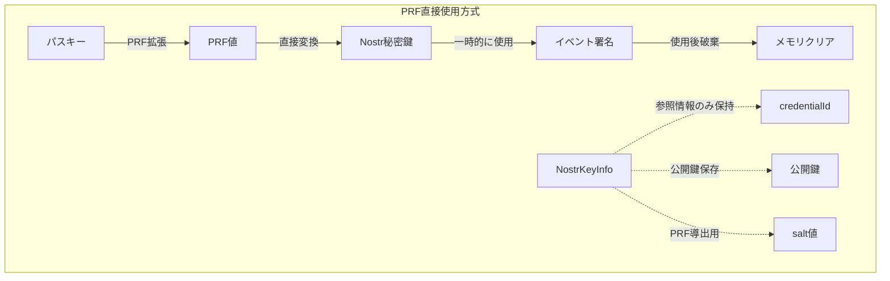
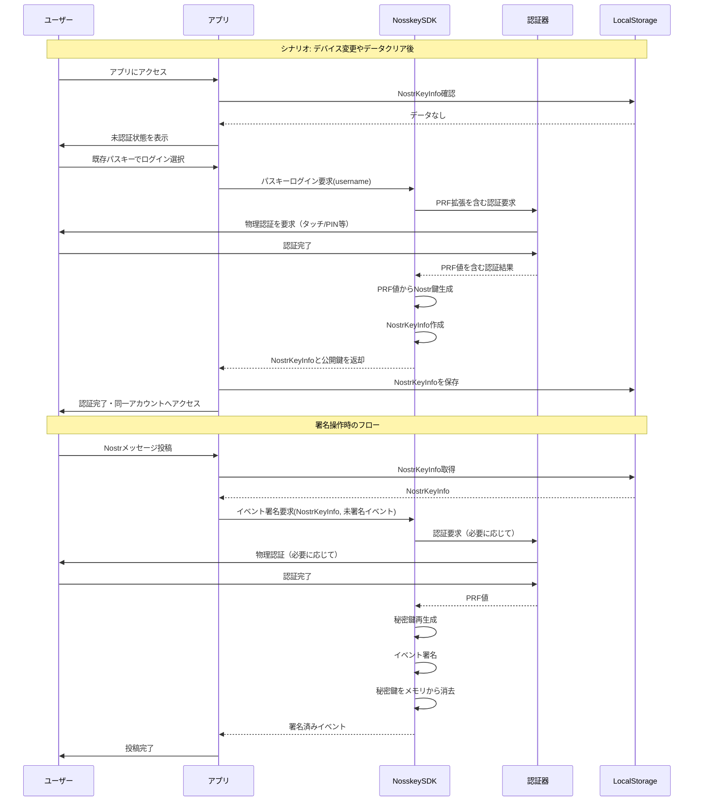
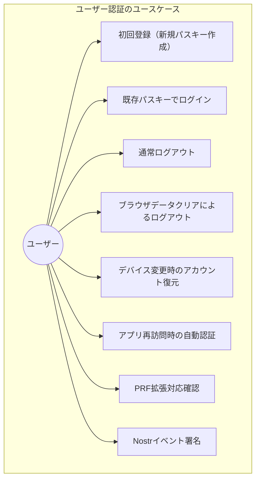

# Nosskeyにおけるユーザー認証のユースケース（PRF直接使用方式）

## 1. PRF直接使用方式の概念

NosskeyはパスキーのPRF（Pseudo-Random Function）拡張を直接使用してNostr秘密鍵を導出する方式を採用しています。この方式では：

- **秘密鍵は明示的に保存されません** - パスキー認証時にPRF値から都度生成
- **同じパスキーと同じsaltから常に同一の秘密鍵が生成される**
- **暗号化された秘密鍵をリレーに保存する必要がない** - セキュリティリスクを大幅に軽減
- **デバイス変更時も同じパスキーで完全復元可能**

## 2. 秘密鍵の復元メカニズム

## 3. PRF直接使用方式のメリット

1. **セキュリティの向上**: 
   - 秘密鍵は一時的にのみ生成され、永続保存されない
   - 暗号化された秘密鍵をリレーに保存する必要がない
   - 漏洩リスクが大幅に軽減される

2. **復元の容易さ**: 
   - 同じパスキーと同じsaltから常に同じPRF値が得られる
   - デバイス変更やlocalStorageクリア後も同じ鍵が復元可能
   - バックアップ管理が不要

3. **UX向上**: 
   - 認証方式の選択が不要
   - ユーザー操作が単純化される
   - 秘密鍵バックアップ管理の負担がない

## 4. ユーザー認証のユースケース

### 4.1 ユースケース図

### 4.2 ユースケース詳細

#### 4.2.1 初回登録（新規パスキー作成）
- **アクター**: ユーザー
- **説明**: 初めてアプリを使用するユーザーが新規パスキーを作成し、Nostrアカウントを設定
- **基本フロー**:
  1. ユーザーがPRF拡張対応確認ボタンをクリック
  2. アプリがNosskeySDK経由でPRF拡張対応を確認
  3. PRF拡張対応が確認されたら「新規パスキー作成」ボタンをクリック
  4. ユーザー名を入力
  5. NosskeySDKが認証器との通信を処理
  6. 認証器で認証
  7. パスキーが作成される
  8. NosskeySDKがPRF値からNostr鍵を生成し、NostrKeyInfoを作成
  9. アプリがNostrKeyInfoをlocalStorageに保存
  10. アカウント画面へ自動遷移

#### 4.2.2 既存パスキーでログイン
- **アクター**: ユーザー
- **説明**: 既に作成したパスキーを使用してログイン
- **基本フロー**:
  1. 「既存パスキーでログイン」ボタンをクリック
  2. プラットフォームのUIで自分が登録したパスキーを選択
  3. NosskeySDKが認証処理と認証器通信を実行
  4. 認証器で認証
  5. NosskeySDKがPRF値からNostr鍵を生成し、NostrKeyInfoを作成
  6. SDKがNostrKeyInfoをアプリに返却
  7. アプリがNostrKeyInfoをlocalStorageに保存
  8. アカウント画面へ自動遷移

#### 4.2.3 通常ログアウト
- **アクター**: ユーザー
- **説明**: アプリ内の機能を使用して明示的にログアウト
- **前提条件**: 認証済み状態
- **基本フロー**:
  1. ログアウトボタンをクリック
  2. 状態をリセット（NostrKeyInfoなどをクリア）
  3. アカウント画面へ遷移（未認証状態）

#### 4.2.4 ブラウザデータクリアによるログアウト
- **アクター**: ユーザー
- **説明**: ブラウザのlocalStorageをクリアすることによる非明示的なログアウト
- **前提条件**: 認証済み状態
- **基本フロー**:
  1. ブラウザの設定からlocalStorageをクリア
  2. アプリ再訪問時に未認証状態となる

#### 4.2.5 デバイス変更時のアカウント復元
- **アクター**: ユーザー
- **説明**: 新デバイスでも同じNostrアカウントを復元
- **前提条件**: 同じパスキー（クラウドバックアップされたプラットフォーム認証器か物理認証器）を所有
- **基本フロー**:
  1. 新デバイスでアプリにアクセス（NostrKeyInfoなし）
  2. 「既存パスキーでログイン」を選択
  3. **元と同じユーザー名を入力**（重要）
  4. 同じ認証器で認証
  5. 同一のPRF値が生成され、同一のNostr鍵ペアが導出される
  6. 元のNostr公開鍵でアカウントが復活（リレーからプロフィール等を再取得）

#### 4.2.6 アプリ再訪問時の自動認証
- **アクター**: ユーザー
- **説明**: 一度認証済みのユーザーがブラウザを閉じた後に再度アクセスした場合
- **前提条件**: 過去に認証済みでlocalStorageにNostrKeyInfoが保存されている
- **基本フロー**:
  1. アプリ起動時にlocalStorageをチェック
  2. NostrKeyInfoが存在する場合、自動的に認証状態に設定
  3. アカウント画面が表示される

#### 4.2.7 Nostrイベント署名プロセス
- **アクター**: ユーザー
- **説明**: アプリ内でのNostrイベント（投稿など）の署名
- **基本フロー**:
  1. ユーザーが投稿内容を入力し送信
  2. SDKがlocalStorageからNostrKeyInfoを取得
  3. アプリがNosskeySDKに未署名イベントを渡して署名要求
  4. NosskeySDKが認証器との通信を処理（必要に応じて再認証）
  5. PRF値から秘密鍵を再生成し、SDK内部でイベント署名
  6. 署名後、秘密鍵をメモリから消去
  7. 署名済みイベントがアプリに返却され、リレーに送信

## 5. アプリケーションとSDKの責務分担

NosskeySDKは以下の責務を担い、アプリケーションから複雑な処理を抽象化しています：

1. **認証器との通信**: 
   - WebAuthn APIの複雑な呼び出しをラップ
   - PRF拡張のリクエスト処理
   - 認証器との全ての通信を処理

2. **NostrKeyInfoの処理**:
   - NostrKeyInfoの作成・検証・基本的な保管（localStorage）
   - 標準salt値の管理
   - **※複数アカウント管理などの複雑な管理はアプリ側の責任**

3. **Nostr鍵の処理**:
   - PRF値からNostr鍵への変換
   - 秘密鍵の安全な管理（メモリ上での一時的保持）
   - イベント署名の内部処理
   - 使用後の秘密鍵メモリクリア

4. **状態管理の補助**:
   - 鍵のキャッシュ管理（オプション）

アプリケーション側は以下を担当します：

1. **UI/UX**: 
   - ユーザーインターフェースの提供
   - 認証状態に応じた画面表示

2. **データ永続化**:
   - **複数アカウント管理**
   - 他のアプリケーションデータの管理

3. **認証状態管理**:
   - NostrKeyInfoの有無に基づく認証状態の判定

4. **ビジネスロジック**:
   - Nostrイベントの作成
   - リレーとの通信

## 6. 復元のユニークポイント

Nosskeyの最も特徴的な点は、**「秘密鍵をバックアップしなくても、同じパスキーと同じsaltがあれば完全に同一のNostrアカウントを復元できる」**という点です。これはPRF拡張の特性を活かしたアーキテクチャで、従来の秘密鍵管理の課題（バックアップ、漏洩リスク）を解決しています。

ユーザーにとっては「パスキー（物理認証器）さえ持っていれば、どのデバイスからでも自分のNostrアカウントにアクセスできる」という直感的なメンタルモデルを提供し、UXを大幅に向上させています。

## 7. セキュリティ上の利点

従来の暗号化方式と比較して、PRF直接使用方式は以下のセキュリティ上の利点があります：

| 特性 | 従来の暗号化方式 | PRF直接使用方式 |
|------|-----------------|-----------------|
| 秘密鍵の保存方法 | 暗号化されて保存 | 保存せず、都度生成 |
| データ構造 | 暗号化された秘密鍵 | 参照情報のみ |
| データ紛失時 | 秘密鍵完全喪失（復元不可能） | 同じパスキーで完全復元可能 |
| リスク対策 | バックアップやリレー保存が必要 | パスキー自体の管理のみ |
| セキュリティ特性 | 秘密鍵は暗号化されるが存在 | 秘密鍵は一時的にのみ生成 |
| リレーへの依存 | 暗号化データの保存が必要 | 保存不要 |
| Salt値管理 | 個別管理が必要 | 標準値で統一 |
