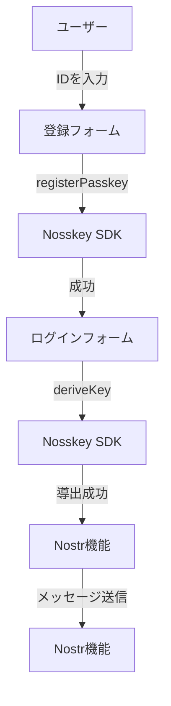

# Nosskey SDK サンプルアプリケーション設計書

## 1. 概要

このドキュメントは、Nosskey SDKを利用したサンプルアプリケーションの設計と実装詳細を記述しています。このアプリケーションは、Passkey（WebAuthn）を利用したNostr鍵導出の仕組みをデモンストレーションするために作成されました。

## 2. アプリケーション構成

### 2.1 技術スタック

- **フロントエンド**: Svelte + SvelteKit（SPAモード）
- **ビルドツール**: Vite
- **Nostr関連**: rx-nostr（現在はモック実装）
- **スタイリング**: カスタムCSS

### 2.2 プロジェクト構造

```
examples/svelte-app/
├── README.md                  # 使用方法や概要の説明
├── svelte.config.js           # SvelteKitの設定
├── vite.config.js             # Viteの設定
├── tsconfig.json              # TypeScriptの設定
├── src/
│   ├── lib/                   # 共通ライブラリ
│   │   ├── index.js           # エクスポート
│   │   └── stores/
│   │       └── nosskey-store.js  # 状態管理ストア
│   │
│   ├── routes/                # ページコンポーネント
│   │   ├── +layout.svelte     # 共通レイアウト
│   │   ├── +page.svelte       # ホームページ（Passkey対応確認）
│   │   ├── register/
│   │   │   └── +page.svelte   # 登録ページ
│   │   ├── login/
│   │   │   └── +page.svelte   # ログインページ
│   │   └── nostr/
│   │       └── +page.svelte   # Nostr機能ページ
│   │
│   └── app.css                # グローバルスタイル
```

## 3. コンポーネント詳細

### 3.1 状態管理（nosskey-store.js）

アプリケーション全体で共有される状態を管理する中心的なストアです。

```javascript
// ストア定義
export const nosskeyInstance = writable(null);  // Nosskeyインスタンス
export const derivedKey = writable(null);      // 導出された鍵情報
export const userId = writable('');           // ユーザーID
export const isAuthenticated = writable(false); // 認証状態
```

### 3.2 ページコンポーネント

#### 3.2.1 ホームページ（+page.svelte）

- Passkey対応確認機能
- `Nosskey.isPasskeySupported()`を使用してブラウザの対応状況を確認
- 対応状況に応じた表示と次のステップへの案内

#### 3.2.2 登録ページ（register/+page.svelte）

- ユーザーID入力フォーム
- Passkey登録処理
- `nosskey.registerPasskey()`を使用したWebAuthn登録フロー
- 登録結果の表示と次のステップへの案内

```javascript
// Passkey登録処理
async function handleRegister() {
  // ...前処理...
  
  const nosskey = new Nosskey({
    userId: userIdValue,
    appNamespace: window.location.hostname,
    salt: 'demo-app-v1'
  });
  
  const result = await nosskey.registerPasskey({
    userID: userIdValue,
    userDisplayName: userIdValue
  });
  
  // ...結果処理...
}
```

#### 3.2.3 ログインページ（login/+page.svelte）

- ユーザーID入力フォーム
- Passkey認証と鍵導出処理
- `nosskey.deriveKey()`を使用したWebAuthn認証と鍵導出
- 導出された公開鍵の表示と次のステップへの案内

```javascript
// ログイン処理
async function handleLogin() {
  // ...前処理...
  
  const nosskey = new Nosskey({
    userId: userIdValue,
    appNamespace: window.location.hostname,
    salt: 'demo-app-v1'
  });
  
  const derived = await nosskey.deriveKey();
  publicKeyHex = Nosskey.toHex(derived.pk);
  
  // 認証状態の更新
  userId.set(userIdValue);
  nosskeyInstance.set(nosskey);
  derivedKey.set(derived);
  isAuthenticated.set(true);
  
  // ...結果処理...
}
```

#### 3.2.4 Nostr機能ページ（nostr/+page.svelte）

- ユーザー情報表示（ID・公開鍵）
- メッセージ入力・送信機能
- 認証状態チェックとリダイレクト処理
- Nostrイベント作成とモック送信処理

```javascript
// Nostrメッセージ送信
async function sendNostrMessage() {
  // ...前処理...
  
  // Nostrイベント作成
  const event = {
    kind: 1,
    content: messageValue,
    tags: [],
    created_at: Math.floor(Date.now() / 1000),
    pubkey: publicKeyHex
  };
  
  // 秘密鍵を16進数形式に変換
  const skHex = Nosskey.toHex($derivedKey.sk);
  
  // モック実装（実際はrx-nostrを使用）
  setTimeout(() => {
    status = {
      success: true,
      message: 'メッセージを送信しました！（モックレスポンス）'
    };
    // ...結果処理...
  }, 1000);
}
```

### 3.3 共通レイアウト（+layout.svelte）

- ヘッダー（タイトルとナビゲーション）
- メインコンテンツエリア
- フッター

## 4. データフロー



1. **登録フロー**:
   - ユーザーIDを入力
   - `nosskey.registerPasskey()`でPasskey登録
   - 登録成功時、ストアに情報を保存

2. **ログインフロー**:
   - ユーザーIDを入力
   - `nosskey.deriveKey()`で鍵導出
   - 導出された鍵情報をストアに保存
   - 認証状態を更新

3. **Nostr機能**:
   - 認証状態チェック（未認証時はリダイレクト）
   - ユーザー情報と鍵情報の表示
   - メッセージ入力と送信（モック）

## 5. 技術的考慮事項

### 5.1 WebAuthn/Passkey対応

- `localhost`または`HTTPS`環境での実行が必要
- 対応ブラウザ: Chrome、Firefox、Safari最新版など
- ハードウェアセキュリティデバイスまたはプラットフォーム組み込み認証機能が必要

### 5.2 状態管理

- Svelteのreactiveストアを使用
- アプリケーション全体での状態共有

### 5.3 モックとリアル実装

- 現在のNostrメッセージ送信はモック実装
- 実際のリレー通信は実装されていない（将来的にrx-nostr連携）

## 6. 開発・実行方法

### 6.1 開発環境のセットアップ

```bash
# 依存関係のインストール
cd examples/svelte-app
npm install

# 開発サーバーの起動
npm run dev
```

### 6.2 ビルドと本番デプロイ

```bash
# 本番ビルド
npm run build

# ビルド結果のプレビュー
npm run preview
```

## 7. 将来的な拡張ポイント

1. **実際のNostrリレー接続**:
   - rx-nostrを使用した実際のリレー通信の実装
   - リレーリストの設定機能

2. **メッセージ履歴表示**:
   - 過去のメッセージ取得と表示
   - タイムライン機能の実装

3. **プロフィール管理**:
   - kind:0イベントの送信と管理
   - プロフィール情報の表示・編集

4. **マルチデバイス対応**:
   - 複数デバイスでの鍵同期メカニズム
   - クロスプラットフォーム対応
