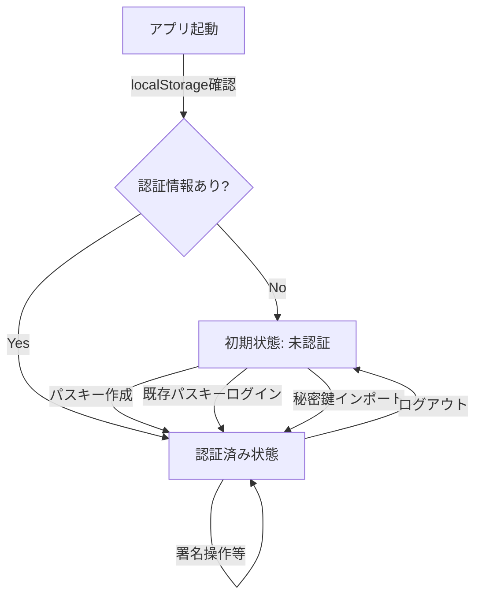
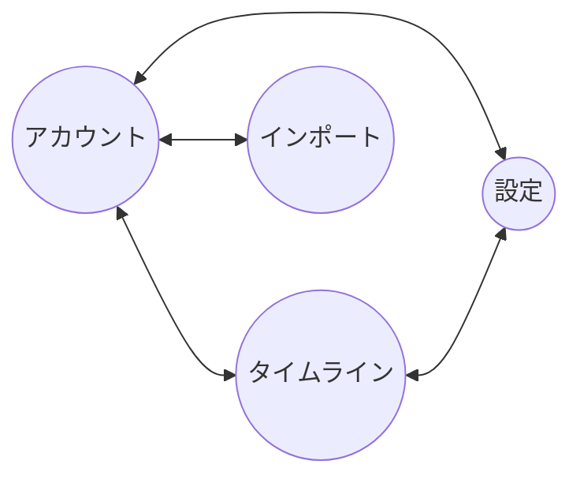

# Nosskey SDK サンプルアプリケーション設計書

## 1. 概要

このドキュメントは、Nosskey SDKを利用したサンプルアプリケーションの設計と実装詳細を記述しています。このアプリケーションは、Passkey（WebAuthn）を利用したNostr鍵管理の仕組みをデモンストレーションするために作成されました。パスキーとNostr鍵の統合により、安全かつユーザーフレンドリーな鍵管理を実現しています。

## 2. アプリケーション構成

### 2.1 技術スタック

- **フロントエンド**: Svelte v5
- **構成**: シンプルなSPA（4画面切り替え方式）
- **ビルドツール**: Vite
- **Nostr関連**: rx-nostr
- **鍵管理**: Nosskey SDK
- **多言語対応**: カスタムi18nストア
- **スタイリング**: カスタムCSS + SVGアイコン

### 2.2 プロジェクト構造

```
examples/svelte-app/
├── public/
│   └── nosskey.svg                # アプリアイコン
├── src/
│   ├── components/
│   │   ├── FooterMenu.svelte      # フッターナビゲーション
│   │   ├── HeaderBar.svelte       # ヘッダーバー
│   │   ├── PostForm.svelte        # 投稿フォーム
│   │   ├── ProfileEditor.svelte   # プロフィール編集
│   │   ├── PublicKeyDisplay.svelte # 公開鍵表示
│   │   ├── Timeline.svelte        # タイムライン表示
│   │   ├── screens/               # 画面コンポーネント
│   │   │   ├── AccountScreen.svelte    # アカウント画面
│   │   │   ├── AuthScreen.svelte       # 認証画面
│   │   │   ├── SettingsScreen.svelte   # 設定画面
│   │   │   └── TimelineScreen.svelte   # タイムライン画面
│   │   ├── settings/              # 設定関連コンポーネント
│   │   │   ├── AppInfo.svelte          # アプリ情報
│   │   │   ├── ExportKeyInfoComponent.svelte # PWKエクスポート
│   │   │   ├── ExportSecretKey.svelte  # 秘密鍵エクスポート
│   │   │   ├── LanguageSettings.svelte # 言語設定
│   │   │   ├── LocalStorageSection.svelte # ローカルストレージ
│   │   │   ├── LogoutSection.svelte    # ログアウト
│   │   │   ├── RelayManagement.svelte  # リレー管理（接続状況表示付き）
│   │   │   ├── SecretCacheSettings.svelte # キャッシュ設定
│   │   │   ├── SettingSection.svelte   # 設定セクション基底
│   │   │   └── theme-settings.svelte   # テーマ設定
│   │   └── ui/                    # UIコンポーネント
│   │       ├── Button.svelte           # 基本ボタン
│   │       ├── DangerButton.svelte     # 危険操作ボタン
│   │       ├── IconButton.svelte       # アイコンボタン
│   │       ├── SecondaryButton.svelte  # セカンダリボタン
│   │       └── WarningButton.svelte    # 警告ボタン
│   ├── assets/                    # SVGアイコンなど
│   │   ├── account-icon.svg
│   │   ├── copy-icon.svg
│   │   ├── home-icon.svg
│   │   ├── nosskey.svg
│   │   ├── setting-icon.svg
│   │   └── svelte.svg
│   ├── i18n/                      # 多言語対応関連
│   │   ├── i18n-store.ts          # 言語ストア
│   │   └── translations.ts        # 翻訳データ
│   ├── services/
│   │   ├── nosskey-manager.service.ts # PWK管理サービス
│   │   ├── relay.service.ts       # リレー接続サービス
│   │   └── test-rxnostr.ts        # テスト用ユーティリティ 
│   ├── store/
│   │   ├── app-state.ts           # アプリケーション状態管理
│   │   ├── relay-store.ts         # リレー状態管理
│   │   └── timeline-store.ts      # タイムライン状態管理
│   ├── utils/
│   │   ├── bech32-converter.ts    # Bech32変換ユーティリティ
│   │   └── bech32-converter.spec.ts # 変換テスト
│   ├── app.css                    # グローバルスタイル
│   ├── App.svelte                 # メインアプリコンポーネント
│   ├── main.ts                    # エントリーポイント
│   └── vite-env.d.ts              # Vite型定義
├── index.html
├── package.json
└── vite.config.ts
```

## 3. 機能とコンポーネント詳細

### 3.1 状態管理

#### app-state.ts
アプリケーションの状態管理を行うストア：
- `defaultRelays` - デフォルトで使用するリレーの配列
- `currentScreen` - 現在の画面を保持するwritableストア（'account'、'timeline'、'settings'、'import'）
- `isLoggedIn` - 認証状態を管理
- `publicKey` - Nostr公開鍵
- `cacheSecrets` - 秘密鍵情報をキャッシュするかどうかのフラグ
- `cacheTimeout` - キャッシュのタイムアウト時間（秒）
- `resetState()` - 全ての状態をリセットする関数
- `logout()` - ログアウト処理を行う関数

#### relay-store.ts
リレー関連の状態管理を行うストア：
- `activeRelays` - 現在使用中のリレーリスト
- `relayService` - リレーサービスのシングルトンインスタンス
- リレーリストの初期化・保存機能
- ストレージとの同期機能

#### timeline-store.ts
タイムライン関連の状態管理を行うストア：
- タイムラインイベントの管理
- イベントの取得・更新・削除機能
- タイムライン表示状態の管理

### 3.2 サービス

#### nosskey-manager.service.ts
Nosskey管理サービス：
- `getNosskeyManager()` - NosskeyManagerのシングルトンインスタンスを取得
- キャッシュ設定の動的更新機能
- シークレットキーのキャッシュクリア機能
- 鍵情報の保存・復元機能

#### relay.service.ts
Nostrリレーとの通信を管理するサービス：
- リレーの追加・削除・状態管理
- イベント送信機能
- タイムライン取得機能
- リレー状態監視機能

### 3.3 画面コンポーネント

#### App.svelte
アプリケーションのメインコンポーネント：
- URLハッシュに基づく画面初期化と切り替え
- 状態に応じた画面の表示（AccountScreen、TimelineScreen、SettingsScreen）
- グローバルスタイルの定義

#### AccountScreen.svelte
アカウント情報と認証を担当するコンポーネント：
- 認証状態による表示切り替え
  - 未認証時はAuthScreenを表示
  - 認証済み時はアカウント情報（公開鍵情報、プロフィール）を表示
- ローカルストレージと認証状態の整合性チェック

#### AuthScreen.svelte
認証機能を担当するコンポーネント：
- パスキー新規作成機能
- 既存パスキーでのログイン機能
- インポート画面への遷移機能
- PRF拡張対応確認機能

#### TimelineScreen.svelte
タイムライン表示と投稿機能を担当するコンポーネント：
- 認証状態による表示切り替え
- PostFormとTimelineコンポーネントの統合

#### SettingsScreen.svelte
設定画面のコンテナコンポーネント：
- 各種設定セクションの統合

### 3.4 設定コンポーネント

設定画面は複数の独立した設定セクションで構成されています：

- **SettingSection.svelte** - 設定セクションの基底コンポーネント（共通レイアウトとスタイル）
- **RelayManagement.svelte** - リレーの追加・削除・リセット機能、接続状況表示
- **SecretCacheSettings.svelte** - 秘密鍵キャッシュの設定
- **LanguageSettings.svelte** - アプリケーション言語の切り替え
- **theme-settings.svelte** - テーマ設定（ダークモード・ライトモード切り替え）
- **LogoutSection.svelte** - ログアウト機能
- **LocalStorageSection.svelte** - ローカルストレージのクリア機能
- **ExportKeyInfoComponent.svelte** - PWKデータのエクスポート機能
- **ExportSecretKey.svelte** - 秘密鍵のエクスポート機能
- **AppInfo.svelte** - アプリケーション情報の表示

### 3.5 共通コンポーネント

#### HeaderBar.svelte
アプリケーション上部のヘッダーバーコンポーネント：
- アプリケーションタイトルとロゴの表示
- 現在の画面タイトルの表示
- 統一されたヘッダーデザインの提供

#### FooterMenu.svelte
アプリケーションナビゲーションを担当するコンポーネント：
- 現在の画面に応じたアクティブ状態表示
- 画面遷移機能

#### PostForm.svelte
Nostrメッセージ作成・投稿機能を担当するコンポーネント：
- メッセージ入力フォーム
- イベント署名機能
- リレーへのメッセージ送信機能
- 投稿状態とエラーハンドリング

#### ProfileEditor.svelte
ユーザープロフィール編集機能を担当するコンポーネント：
- プロフィール情報の表示・編集
- プロフィールデータの保存機能
- プロフィール画像やメタデータの管理

#### PublicKeyDisplay.svelte
公開鍵情報を表示するコンポーネント：
- 公開鍵情報の表示（短縮形式とnpub形式）
- npub形式のクリップボードコピー機能
- コピー完了メッセージの表示

#### Timeline.svelte
タイムライン表示機能を担当するコンポーネント：
- Nostrイベントの時系列表示
- リアルタイムでのイベント更新
- イベントの詳細表示機能

### 3.6 UIコンポーネント

アプリケーション全体で統一されたUIコンポーネント群：

#### Button.svelte
基本的なボタンコンポーネント：
- 標準的なアクション用ボタン
- 統一されたスタイルとホバー効果
- クリックイベントハンドリング

#### SecondaryButton.svelte
セカンダリアクション用ボタンコンポーネント：
- サブアクションやキャンセル操作用
- 控えめなスタイルデザイン

#### WarningButton.svelte
警告を伴うアクション用ボタンコンポーネント：
- 注意が必要な操作用（例：データリセット）
- 警告色を使用したスタイル

#### DangerButton.svelte
危険なアクション用ボタンコンポーネント：
- 削除やログアウトなどの重要な操作用
- 赤色系の警告色を使用

#### IconButton.svelte
アイコン付きボタンコンポーネント：
- アイコンとテキストを組み合わせたボタン
- 視覚的に分かりやすいアクション表現

## 4. 多言語対応

アプリケーションは多言語対応（i18n）機能を実装しています：

### 4.1 i18n実装

#### i18n-store.ts
言語設定とテキスト管理：
- `currentLanguage` - 現在の言語設定（'ja'または'en'）
- `i18n` - 翻訳データを提供するderivedストア
- `changeLanguage()` - 言語を切り替える関数
- ブラウザ設定に基づく言語自動選択機能
- 設定画面から言語を選択できる

#### translations.ts
言語リソースの定義：
- 日本語（ja）と英語（en）の翻訳セット
- 階層構造を持つ翻訳オブジェクト
- アプリケーション全体のテキストリソース

## 5. データフロー

### 5.1 起動時フロー

1. アプリ起動時に初期化
   - ストアの初期化
   - ローカルストレージのチェック
   - URLハッシュに基づく画面表示
   - 言語設定の読み込み
   - 認証状態と保存データの整合性検証

### 5.2 認証フロー

#### 新規パスキー作成
1. 新規パスキー作成
   - `createPasskey()` メソッドで新規パスキー作成
   - PRFから直接Nostr鍵を導出
2. 結果を保存
3. 認証状態の更新
4. タイムライン画面へ自動遷移

#### 既存パスキーでログイン
1. プラットフォームのUIから選択したパスキーでWebAuthn認証
2. PRF値からNostr鍵を再生成
3. 認証状態の更新
4. タイムライン画面へ自動遷移

#### 秘密鍵のインポート
1. 秘密鍵入力（nsecまたは16進数形式）
2. 新規パスキーの作成
3. 秘密鍵をパスキーで保護（PWK）
4. 認証状態の更新
5. タイムライン画面へ自動遷移

### 5.3 メッセージ投稿フロー

1. メッセージ作成（kind=1のテキストノート）
2. 復号した秘密鍵でイベント署名
3. 設定されたリレーへのメッセージ送信

### 5.4 ログアウトフロー

1. ログアウト関数の呼び出し
2. SDKのpwkBlobをクリア
3. 認証状態のリセット
4. ストアの状態更新
5. アカウント画面への遷移（未認証状態）

## 6. ユーザー状態と状態遷移

アプリケーションのユーザー状態は主に認証状態（isLoggedIn）と公開鍵情報の有無によって管理されています。

### 6.1 状態モデル

1. **未ログイン状態**:
   - `isLoggedIn = false`, `publicKey = null`
   - 初回起動時や認証情報クリア後の状態
   - AccountScreenはAuthScreenコンポーネントを表示

2. **ログイン状態**:
   - `isLoggedIn = true`, `publicKey ≠ null`
   - パスキー認証後またはlocalStorageから復元後
   - AccountScreenはプロフィールとリレー状態を表示

### 6.2 状態遷移のフローダイアグラム



### 6.3 画面状態と遷移

アプリケーションは4つの主要画面（`account`, `timeline`, `settings`, `import`）を持ち、これらはURLハッシュと連動しています。画面状態はappState.tsの`currentScreen`ストアで管理されます。



### 6.4 設定の管理

アプリケーション設定は以下のように管理されます：

- **言語設定**: `currentLanguage`ストアとlocalStorage
- **リレー設定**: `activeRelays`ストアとlocalStorage
- **キャッシュ設定**: `cacheSecrets`および`cacheTimeout`ストアとlocalStorage

これらの設定はユーザーインターフェイスを通じて変更でき、変更はリアルタイムでSDKや関連コンポーネントに反映されます。

## 7. 技術的考慮事項

### 7.1 WebAuthn/Passkey対応

- `localhost`または`HTTPS`環境での実行が必要
- 最新のChrome、Firefox、Safariなどのモダンブラウザでの動作を想定

### 7.2 UI/UXの設計

- 4つの主要画面によるシンプルなナビゲーション
- フッターメニューによる直感的な画面切り替え
- 認証状態に応じた適切な画面表示の制御

## 8. 開発・実行方法

```bash
# リポジトリのクローン
git clone https://github.com/ocknamo/nosskey-sdk.git
cd nosskey-sdk

# 依存関係のインストールとビルド
npm install
npm run build

# サンプルアプリの依存関係インストール
cd examples/svelte-app
npm install

# 開発サーバー起動
npm run dev
```

ブラウザで http://localhost:5173 にアクセスしてアプリケーションを利用できます。
