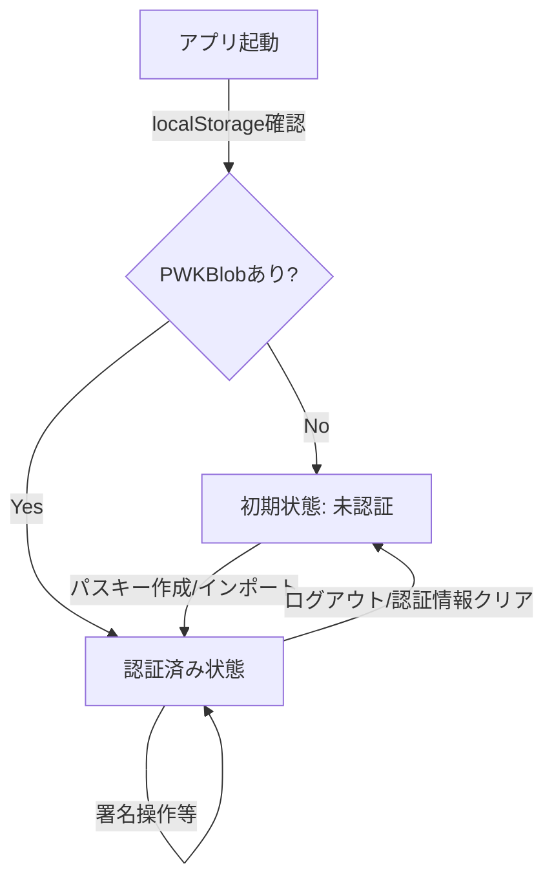

# Nosskey SDK サンプルアプリケーション設計書

## 1. 概要

このドキュメントは、Nosskey SDKを利用したサンプルアプリケーションの設計と実装詳細を記述しています。このアプリケーションは、Passkey（WebAuthn）を利用したNostr鍵ラップの仕組みをデモンストレーションするために作成されました。特に、PRF拡張の出力値を直接Nostrのシークレットキーとして使用する`directPrfToNostrKey`メソッドに焦点を当てています。

## 2. アプリケーション構成

### 2.1 技術スタック

- **フロントエンド**: Svelte v5
- **構成**: シンプルなSPA（3画面切り替え方式）
- **ビルドツール**: Vite
- **Nostr関連**: rx-nostr
- **鍵管理**: Nosskey SDK (`directPrfToNostrKey` メソッド)
- **スタイリング**: カスタムCSS + SVGアイコン

### 2.2 プロジェクト構造

```
examples/svelte-app/
├── public/
├── src/
│   ├── components/
│   │   ├── AccountScreen.svelte   # アカウント画面
│   │   ├── AuthScreen.svelte      # 認証コンポーネント
│   │   ├── FooterMenu.svelte      # フッターナビゲーション
│   │   ├── PostForm.svelte        # 投稿フォーム
│   │   ├── ProfileEditor.svelte   # プロフィール編集
│   │   ├── RelayStatus.svelte     # リレー接続状態
│   │   ├── SettingsScreen.svelte  # 設定画面
│   │   ├── Timeline.svelte        # タイムライン表示
│   │   └── TimelineScreen.svelte  # タイムライン画面
│   ├── assets/
│   │   ├── account-icon.svg       # アカウントアイコン
│   │   ├── home-icon.svg          # タイムラインアイコン 
│   │   └── setting-icon.svg       # 設定アイコン
│   ├── store/
│   │   └── appState.ts            # アプリケーション状態管理
│   ├── App.svelte                 # メインアプリコンポーネント
│   └── main.ts                    # エントリーポイント
├── index.html
├── package.json
└── vite.config.ts
```

## 3. コンポーネント詳細

### 3.1 状態管理

#### appState.ts
アプリケーションの状態管理を行うストア：
- `defaultRelays` - デフォルトで使用するリレーの配列
- `currentScreen` - 現在の画面を保持するwritableストア（'account'、'timeline'または'settings'）
- `isLoggedIn` - 認証状態を管理
- `pwkBlob` - パスキー派生のNostr鍵情報
- `publicKey` - Nostr公開鍵
- `resetState()` - 全ての状態をリセットする関数
- `cacheSecrets` - 秘密鍵情報をキャッシュするかどうか
- `cacheTimeout` - キャッシュのタイムアウト時間（秒）

### 3.2 コンポーネント

#### AccountScreen.svelte
アカウント情報と認証を担当するコンポーネント：
- 認証状態による表示切り替え
  - 未認証時はAuthScreenを表示
  - 認証済み時はアカウント情報（プロフィール、リレー状態）を表示
- ローカルストレージと認証状態の整合性チェック
- 状態変化の監視とエラーハンドリング

#### AuthScreen.svelte
認証機能を担当するコンポーネント：
- PRF拡張対応確認ボタン
  - ユーザーアクションでPRF拡張対応状況を確認
- パスキー新規作成機能
  - `createPasskey()`メソッドで新規パスキー作成
  - `directPrfToNostrKey()`メソッドでPRFから直接Nostr鍵を導出
- 既存パスキーでのログイン機能
- ブラウザ対応状況表示
- エラーハンドリング

#### TimelineScreen.svelte
タイムライン表示と投稿機能を担当するコンポーネント：
- 認証状態による表示切り替え
  - 未認証時は認証要求メッセージを表示
  - 認証済み時はタイムラインと投稿フォームを表示
- PostFormとTimelineコンポーネントを統合
- ユーザーインタラクション管理

#### PostForm.svelte
Nostrメッセージ作成・投稿機能を担当するコンポーネント：
- メッセージ入力フォーム（常にkind=1のテキストノート）
- イベント署名機能
  - パスキーを使用してNostrイベントに署名
- デフォルトリレーへのメッセージ送信機能
- 投稿状態とエラーハンドリング

#### RelayStatus.svelte
リレー接続状態と公開鍵を表示するコンポーネント：
- 公開鍵情報の表示（短縮形式とnpub形式）
- リレー接続状態の視覚的な表示
- ステータスに応じた色分け表示

#### FooterMenu.svelte
アプリケーションナビゲーションを担当するコンポーネント：
- SVGアイコンを使用したナビゲーションタブ
  - アカウント画面（account-icon.svg）
  - タイムライン画面（home-icon.svg）
  - 設定画面（setting-icon.svg）
- 現在の画面に応じたアクティブ状態表示
- 画面遷移機能

#### App.svelte
アプリケーションのメインコンポーネント：
- URLハッシュに基づく画面初期化
- 状態に応じた画面切り替え（AccountScreen ⇔ TimelineScreen ⇔ SettingsScreen）
- 全体のスタイル定義

## 4. データフロー

1. アプリ起動時に初期化
   - ローカルストレージのチェック
   - 認証状態と保存データの整合性検証
2. ユーザーがPRF拡張対応確認ボタンをクリック
3. PRF拡張が対応している場合、パスキー作成・ログインボタンを表示
4. パスキー登録時：
   - 新規パスキー作成
   - PRF値から直接シークレットキー導出
   - 結果をストアとlocalStorageに保存
   - アカウント画面へ自動遷移
5. 既存パスキーでログイン時：
   - 保存されたcredentialIdを使用して認証
   - PRF値からNostr鍵を再生成
   - アカウント画面へ自動遷移
6. Nostrメッセージ投稿時：
   - イベント作成と署名（pwkBlobから情報取得）
   - リレーへの送信
7. ログアウト時：
   - 状態をリセット
   - アカウント画面へ遷移（未認証状態）

## 5. ユーザー状態と状態遷移

アプリケーションのユーザー状態は主に認証状態（isLoggedIn）とPWKBlobの有無によって管理されています。詳細なユーザー認証のユースケースとPWKBlob概念については、[PWKBlobとユーザー認証ユースケース](../../docs/pwkblob-auth-usecases.md)を参照してください。

### 5.1 状態モデル

本アプリケーションでは、「PWKBlobが存在すること」をログイン状態と定義しています。これにより、ユーザーの状態は以下のように明確に表現されます：

1. **未ログイン状態（パスキーなし）**: 
   - `isLoggedIn = false`, `pwkBlob = null`
   - 初回起動時や認証情報クリア後の状態
   - AccountScreenはAuthScreenコンポーネントを表示

2. **ログイン状態（PWKBlobあり）**:
   - `isLoggedIn = true`, `pwkBlob ≠ null`
   - パスキー認証後またはlocalStorageから復元後
   - AccountScreenはプロフィールとリレー状態を表示

この定義の利点は、同じパスキーと同じusernameを使用すれば、PWKBlobを失った場合でも復元可能であるという点です。また、状態の判定基準が単一の条件（PWKBlobの存在）で完結するため、実装が単純化されます。

### 5.2 状態の同期メカニズム

AccountScreenコンポーネントは、マウント時にlocalStorageとの整合性チェックを実施します：

```javascript
// 保存されているPWKBlobがあるかどうかをチェック
const savedPwkBlob = localStorage.getItem("nosskey_pwk_blob");

// ローカルストレージに認証情報があるのに認証状態がfalseの場合は修正
if (savedPwkBlob && !$isLoggedIn) {
  isLoggedIn.set(true);
}

// 逆に認証情報がないのに認証状態がtrueの場合も修正
if (!savedPwkBlob && $isLoggedIn) {
  isLoggedIn.set(false);
}
```

これにより、isLoggedInフラグとPWKBlobの存在が常に同期された状態を保ちます。

### 5.3 状態遷移のフローダイアグラム



### 5.4 キャッシュと認証

秘密鍵のキャッシュはSDK内部で管理され、以下の設定で制御されます：

- `cacheSecrets`: キャッシュを有効/無効にする設定
- `cacheTimeout`: キャッシュの有効期間（秒）

これらの設定はSettingsScreenで変更可能で、変更はSDKに反映されます。

## 6. 技術的考慮事項

### 6.1 WebAuthn/Passkey対応

- `localhost`または`HTTPS`環境での実行が必要
- Chrome または Safari最新版での動作を想定
- PRF拡張をサポートする認証器（YubiKey等）が必要

### 6.2 PRF直接使用の利点

- 鍵の暗号化/復号が不要でシンプル
- 毎回同じパスキーを使えば同じ公開鍵が生成される
- ユーザー体験の向上（認証と署名が一体化）

### 6.3 制限事項

- WebAuthn PRF拡張は比較的新しい機能で、全てのブラウザや認証器で対応していない
- デモ実装のため、リレー接続はシミュレーションのみ
- エラーハンドリングが基本的な実装にとどまっている

### 6.4 UI/UXの設計

- 3つの主要画面（アカウント、タイムライン、設定）によるシンプルなナビゲーション
- フッターメニューによる直感的な画面切り替え
- SVGアイコンを使用したモダンなデザイン
- 認証状態に応じた適切な画面表示の制御
- エラー状態の視覚的フィードバック

## 7. 開発・実行方法

```bash
# リポジトリのクローン
git clone https://github.com/ocknamo/nosskey-sdk.git
cd nosskey-sdk

# 依存関係のインストールとビルド
npm install
npm run build

# サンプルアプリの依存関係インストール
cd examples/svelte-app
npm install

# 開発サーバー起動
npm run dev
```

ブラウザで http://localhost:5173 にアクセスしてアプリケーションを利用できます。
