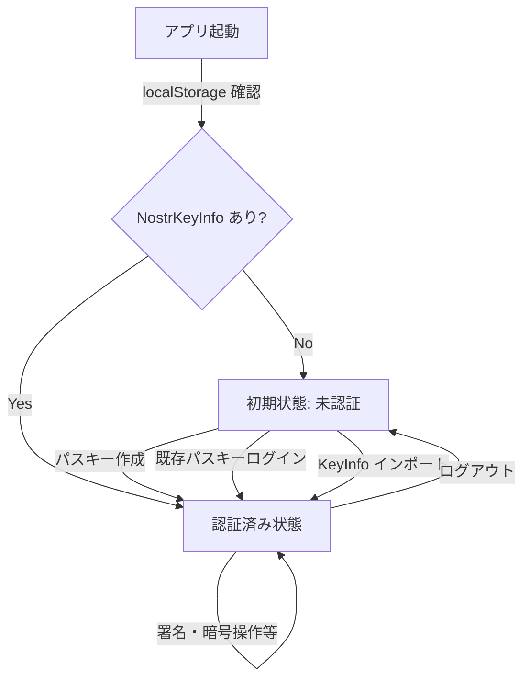
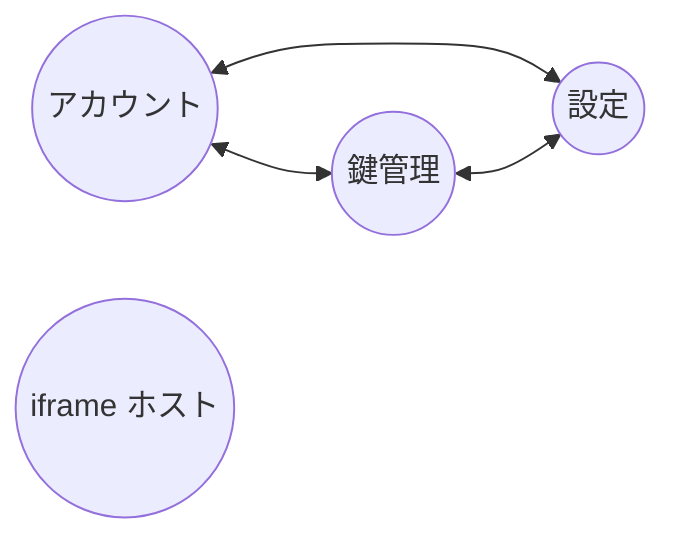

# Nosskey SDK サンプルアプリケーション設計書

## 1. 概要

このドキュメントは、Nosskey SDK を利用したサンプルアプリケーションの設計と実装詳細を記述しています。このアプリケーションは、Passkey（WebAuthn）を利用した Nostr 鍵管理の仕組みをデモンストレーションするために作成されました。パスキーと Nostr 鍵の統合により、安全かつユーザーフレンドリーな鍵管理を実現しています。

通常 UI に加え、`#/iframe` ルートでアクセスされた際には **Nostr 署名プロバイダ iframe としてのみ動作するモード**にも切り替わります（[7. iframe ホストモード](#7-iframe-ホストモード)）。

## 2. アプリケーション構成

### 2.1 技術スタック

- **フロントエンド**: Svelte v5
- **言語**: TypeScript
- **構成**: SPA（ハッシュルーティングによる画面切り替え）
- **ビルドツール**: Vite
- **鍵管理**: Nosskey SDK (`nosskey-sdk`)
- **iframe 連携**: `nosskey-iframe`（署名プロバイダのホスト実装）
- **Bech32 変換**: `bech32`
- **多言語対応**: カスタム i18n ストア
- **スタイリング**: カスタム CSS + CSS variables + SVG アイコン
- **テスト**: Vitest

> このアプリは Nostr リレーへの接続・タイムライン表示・投稿機能を持ちません。リレーは「設定値」として保持し、iframe モードの `getRelays()` 応答に使うのみです。

### 2.2 プロジェクト構造

```
examples/svelte-app/
├── public/
│   ├── _headers                   # Cloudflare Pages 用ヘッダ (Permissions-Policy 等)
│   └── nosskey.svg                # アプリアイコン
├── src/
│   ├── components/
│   │   ├── ConsentDialog.svelte        # iframe モードの同意ダイアログ
│   │   ├── FooterMenu.svelte           # フッターナビゲーション
│   │   ├── HeaderBar.svelte            # ヘッダーバー
│   │   ├── PublicKeyDisplay.svelte     # 公開鍵表示
│   │   ├── screens/                    # 画面コンポーネント
│   │   │   ├── AccountScreen.svelte    # アカウント画面
│   │   │   ├── AuthScreen.svelte       # 認証画面
│   │   │   ├── IframeHostScreen.svelte # iframe ホストモード画面
│   │   │   ├── KeyManagement.svelte    # 鍵管理画面
│   │   │   └── SettingsScreen.svelte   # 設定画面
│   │   ├── settings/                   # 設定セクションコンポーネント
│   │   │   ├── AppInfo.svelte               # アプリ情報
│   │   │   ├── ConsentPolicySettings.svelte # 同意ポリシー設定
│   │   │   ├── ExportKeyInfoComponent.svelte # KeyInfo エクスポート
│   │   │   ├── ExportSecretKey.svelte        # 秘密鍵エクスポート
│   │   │   ├── LanguageSettings.svelte       # 言語設定
│   │   │   ├── LocalStorageSection.svelte    # ローカルストレージ操作
│   │   │   ├── LogoutSection.svelte          # ログアウト
│   │   │   ├── RelaySettings.svelte          # リレー設定
│   │   │   ├── SecretCacheSettings.svelte    # 秘密鍵キャッシュ設定
│   │   │   ├── TrustedOriginsSettings.svelte # 信頼済みオリジン管理
│   │   │   └── theme-settings.svelte         # テーマ設定
│   │   └── ui/                         # 汎用 UI コンポーネント
│   │       ├── CardSection.svelte
│   │       └── button/
│   │           ├── Button.svelte
│   │           ├── FileInputButton.svelte
│   │           ├── IconButton.svelte
│   │           ├── NavButton.svelte
│   │           ├── TabButton.svelte
│   │           └── ToggleButton.svelte
│   ├── assets/                     # SVG アイコンなど
│   ├── i18n/                       # 多言語対応
│   │   ├── i18n-store.ts           # 言語ストア
│   │   └── translations.ts         # 翻訳データ
│   ├── services/
│   │   ├── nosskey-manager.service.ts # NosskeyManager シングルトン管理
│   │   └── relays-store.ts            # リレー設定の永続化
│   ├── store/
│   │   ├── app-state.ts            # アプリ状態・同意ゲート設定
│   │   └── secret-cache-settings.ts # 秘密鍵キャッシュ設定ストア
│   ├── utils/
│   │   ├── bech32-converter.ts     # hex ⇔ npub/nsec 変換
│   │   ├── consent-gating.ts       # 同意判定ロジック
│   │   └── event-kind-labels.ts    # kind 番号のラベル化
│   ├── iframe-mode.ts              # iframe ホスト起動・consent ブリッジ
│   ├── App.svelte                  # メインアプリコンポーネント
│   ├── main.ts                     # エントリーポイント
│   └── vite-env.d.ts               # Vite 型定義
├── index.html
├── package.json
├── svelte.config.js
└── vite.config.ts
```

`*.spec.ts`（`iframe-mode.spec.ts`・`store/app-state.spec.ts`・`utils/*.spec.ts`）は Vitest によるテストです。

## 3. 機能とコンポーネント詳細

### 3.1 状態管理

#### app-state.ts
アプリケーションの中心的な状態管理ストア：

- `currentScreen` - 現在の画面を保持する writable ストア（`ScreenName = 'account' | 'settings' | 'key' | 'iframe'`）
- `isLoggedIn` - 認証状態
- `publicKey` - Nostr 公開鍵
- `currentTheme` - テーマ設定（`'light' | 'dark' | 'auto'`）
- `trustedOrigins` - 信頼済みオリジン（`TrustedOriginEntry[]`、origin × method 単位）
- `consentPolicy` - メソッド別の同意ポリシー（`signEvent` / `nip44` / `nip04` ごとに `ask` / `always` / `deny`）
- `denyCounts` - `deny` ポリシーで自動拒否された回数（プロセス内のみ）
- `storageCorruption` - 保存済み設定が破損していたことを示すフラグ
- `isScreenName()` - ハッシュ文字列が有効な画面名か判定
- `reloadSettings()` - Storage Access グラント後に全設定を読み直す
- `resetState()` / `logout()` - 状態リセット・ログアウト処理

信頼済みオリジン・同意ポリシーは `localStorage`（キー `nosskey_trusted_origins_v2` / `nosskey_consent_policy`）に永続化されます。埋め込みモード時はテーマ・言語を `localStorage` へ書き戻しません。

#### secret-cache-settings.ts
秘密鍵キャッシュ設定のみを定義する leaf モジュール（循環 import 回避のため独立）：

- `cacheSecrets` - 秘密鍵情報をメモリにキャッシュするか
- `cacheTimeout` - キャッシュのタイムアウト時間（秒）

### 3.2 サービス

#### nosskey-manager.service.ts
`NosskeyManager` のシングルトン管理：

- `getNosskeyManager()` - シングルトンインスタンスを取得（未構築なら `rpId` 判定込みで初期化）
- `peekNosskeyManager()` - 構築済みインスタンスを返す（未構築なら `null`、新規構築しない）
- `resetNosskeyManager()` - インスタンスをリセット（主にテスト用）
- `clearSecretCache()` - SDK のキャッシュをクリア
- `cacheSecrets` / `cacheTimeout` ストアを購読し、SDK のキャッシュ設定に反映

#### relays-store.ts
リレー設定の永続化（リレー接続は行わない）：

- `loadRelays(storage?)` - 永続化されたリレーマップ（`RelayMap`）を読み込む
- `saveRelays(relays, storage?)` - リレーマップを保存
- `storage` 引数は partitioned iframe で Storage Access ハンドルを渡すために使う

### 3.3 画面コンポーネント

#### App.svelte
アプリケーションのメインコンポーネント：

- URL ハッシュに基づく画面初期化と切り替え（`hashchange` 監視）
- `screen === "iframe"` のときはルートごと `IframeHostScreen` に差し替え、それ以外は `HeaderBar` + 各画面 + `FooterMenu`
- 画面ごとのスクロール位置の保存・復元
- テーマ（CSS variables）の適用とシステムテーマ変更の監視

#### AccountScreen.svelte
アカウント情報と認証を担当：

- デモアプリに関する注意喚起カードを表示
- 未認証時は `AuthScreen` を表示、認証済み時は `PublicKeyDisplay` を表示
- ローカルストレージと認証状態の整合性チェック

#### AuthScreen.svelte
認証機能を担当：

- 新規パスキー作成（`createPasskey()` → `createNostrKey()`）
- 既存パスキーでのログイン（`credentialId` 指定あり／なし）
- 高度なオプション: `KeyInfo`（PWK データ）のファイル／テキストインポート
- 開発者向けセクション: PRF 拡張対応確認

#### KeyManagement.svelte（`key` 画面）
鍵関連の操作をまとめた画面：

- `SecretCacheSettings` - 秘密鍵キャッシュ設定
- `ExportKeyInfoComponent` - KeyInfo（PWK データ）エクスポート
- `ExportSecretKey` - 秘密鍵エクスポート
- `LogoutSection` - ログアウト
- `LocalStorageSection` - ローカルストレージのクリア

#### SettingsScreen.svelte
アプリ設定のコンテナ。`LanguageSettings` / `ThemeSettings` / `RelaySettings` / `ConsentPolicySettings` / `TrustedOriginsSettings` / `AppInfo` を統合。

#### IframeHostScreen.svelte
`#/iframe` ルートで動作する署名プロバイダモードの画面。詳細は [7. iframe ホストモード](#7-iframe-ホストモード) を参照。

### 3.4 設定コンポーネント（`settings/`）

- **LanguageSettings** - 言語切り替え
- **theme-settings** - テーマ設定（ライト／ダーク／自動）
- **RelaySettings** - リレー設定（追加・削除・リセット）
- **ConsentPolicySettings** - iframe 同意ポリシー（`signEvent` / `nip44` / `nip04` ごとに `毎回確認` / `常に許可` / `拒否`）
- **TrustedOriginsSettings** - 信頼済みオリジンの確認・削除
- **SecretCacheSettings** - 秘密鍵キャッシュの有効化・タイムアウト設定
- **ExportKeyInfoComponent** - KeyInfo（PWK データ）のエクスポート
- **ExportSecretKey** - 秘密鍵のエクスポート
- **LogoutSection** - ログアウト
- **LocalStorageSection** - ローカルストレージのクリア
- **AppInfo** - アプリケーション情報（commit hash 等）

### 3.5 共通コンポーネント

- **HeaderBar** - アプリタイトルとロゴ、現在の画面タイトルを表示
- **FooterMenu** - `account` / `key` / `settings` の 3 画面間ナビゲーション（`iframe` はルート専用でメニューに出ない）
- **PublicKeyDisplay** - 公開鍵を短縮形式と npub 形式で表示、npub のクリップボードコピー
- **ConsentDialog** - iframe モードの同意要求モーダル（[7. iframe ホストモード](#7-iframe-ホストモード)）

### 3.6 UI コンポーネント（`ui/`）

- **CardSection** - カード型セクションの共通レイアウト
- **ui/button/** - `Button` / `FileInputButton` / `IconButton` / `NavButton` / `TabButton` / `ToggleButton`

### 3.7 ユーティリティ（`utils/`）

- **bech32-converter.ts** - hex ⇔ npub / nsec 変換
- **consent-gating.ts** - `evaluateConsent()`（副作用なしの同意判定）と `policyKeyFor()`（メソッド名 → ポリシーキー）
- **event-kind-labels.ts** - `kindLabel()`（kind 番号を人間可読なラベルに変換）

## 4. 多言語対応

#### i18n-store.ts
言語設定とテキスト管理：

- `currentLanguage` - 現在の言語（`'ja'` または `'en'`）
- `i18n` - 翻訳データを提供する derived ストア
- `changeLanguage()` - 言語切り替え
- ブラウザ設定に基づく言語自動選択。埋め込みモードでは親オリジンの `?lang=` 指定を優先

#### translations.ts
日本語（ja）・英語（en）の翻訳セットを階層構造で定義。

## 5. データフロー

### 5.1 起動時フロー

1. ストア初期化（キャッシュ設定・テーマ・同意ポリシー・信頼済みオリジンを `localStorage` から読み込み）
2. URL ハッシュに基づく画面表示
3. 認証状態と保存データ（`NostrKeyInfo`）の整合性検証

### 5.2 認証フロー

#### 新規パスキー作成
1. `createPasskey()` で新規パスキー作成
2. `createNostrKey()` で PRF から Nostr 鍵を導出
3. `setCurrentKeyInfo()` で SDK に設定（内部でストレージに保存）
4. 認証状態を更新し、アカウント画面へ遷移

#### 既存パスキーでログイン
1. プラットフォーム UI から選択したパスキーで WebAuthn 認証
2. PRF 値から Nostr 鍵を再導出
3. 認証状態を更新し、アカウント画面へ遷移

#### KeyInfo（PWK データ）インポート
1. KeyInfo の JSON をファイルまたはテキストで入力
2. 妥当性チェック後 `setCurrentKeyInfo()` でセット
3. 認証状態を更新し、アカウント画面へ遷移

### 5.3 ログアウトフロー

1. `logout()` を呼び出し
2. SDK の `NostrKeyInfo` をクリア（`clearStoredKeyInfo()`）
3. 公開鍵・認証状態をリセット
4. アカウント画面（未認証状態）へ遷移

## 6. ユーザー状態と画面遷移

### 6.1 状態モデル

ユーザー状態は主に認証状態（`isLoggedIn`）と公開鍵情報の有無で管理されます。「`NostrKeyInfo` が存在すること」をログイン状態と定義します。

1. **未ログイン状態**: `isLoggedIn = false`, `publicKey = null`。`AccountScreen` は `AuthScreen` を表示
2. **ログイン状態**: `isLoggedIn = true`, `publicKey ≠ null`。`AccountScreen` は公開鍵情報を表示


```mermaid
graph TD
    A[初期状態: 未認証] -->|パスキー作成| B[認証済み状態]
    A -->|既存パスキーログイン| B
    A -->|KeyInfo インポート| B
    B -->|署名・暗号操作等| B
    B -->|ログアウト| A

    C[アプリ起動] -->|localStorage 確認| D{NostrKeyInfo あり?}
    D -->|Yes| B
    D -->|No| A
```

### 6.2 画面状態と遷移

通常 UI は 3 画面（`account` / `key` / `settings`）を持ち、`FooterMenu` で切り替えます。`iframe` は URL ハッシュ専用のルートで、メニューには現れません。画面状態は `app-state.ts` の `currentScreen` ストアで管理され、URL ハッシュと連動します。


```mermaid
graph LR
    Account((アカウント)) <--> Key((鍵管理))
    Account <--> Settings((設定))
    Key <--> Settings
    Iframe((iframe ホスト))
```

## 7. iframe ホストモード

`#/iframe` ルートでアクセスされると、このアプリは通常 UI を描画せず、別 origin の Nostr アプリから `postMessage` で署名・暗号化要求を受け付ける **NIP-07 署名プロバイダ**として動作します。

主な構成要素：

- **`iframe-mode.ts`** - `NosskeyIframeHost` の起動（`startIframeHost()`）と consent ブリッジ（`onConsent` / `approveConsent` / `rejectConsent` / `pendingConsent` ストア）
- **`IframeHostScreen.svelte`** - エントリ画面。Storage Access API によるリカバリフローを実行
- **`ConsentDialog.svelte`** - 同意要求モーダル（拒否 / 常に許可 / 一度だけ許可の 3 ボタン）
- **`consent-gating.ts`** + **`app-state.ts`** - 同意ポリシー（`ConsentPolicy`）と信頼済みオリジン（`TrustedOriginEntry`）による同意ゲーティング

対応メソッドは `getPublicKey` / `signEvent` / `getRelays` / `nip44_encrypt` / `nip44_decrypt` / `nip04_encrypt` / `nip04_decrypt` の 7 種です。

詳細な仕組み（通信フロー・Storage Partitioning 対応・テーマ／言語の受け渡し）は [`docs/ja/iframe-host.ja.md`](../../docs/ja/iframe-host.ja.md) を参照してください。

## 8. 技術的考慮事項

### 8.1 WebAuthn / Passkey 対応

- `localhost` または `HTTPS` 環境での実行が必要
- WebAuthn PRF 拡張をサポートするブラウザ・認証器が必要（[PRF 対応表](../../docs/ja/prf-support-tables.ja.md)）

### 8.2 UI / UX の設計

- 通常 UI は 3 画面のシンプルなナビゲーション
- フッターメニューによる直感的な画面切り替え
- テーマは CSS variables で管理し、ライト／ダーク／自動に対応

## 9. 開発・実行方法

```bash
# リポジトリのクローン
git clone https://github.com/ocknamo/nosskey-sdk.git
cd nosskey-sdk

# 依存関係のインストールと SDK のビルド
npm install
npm run build

# サンプルアプリの依存関係インストール
cd examples/svelte-app
npm install

# 開発サーバー起動
npm run dev
```

ブラウザで http://localhost:5173 にアクセスしてアプリケーションを利用できます。iframe ホストモードは http://localhost:5173/#/iframe で動作します。
